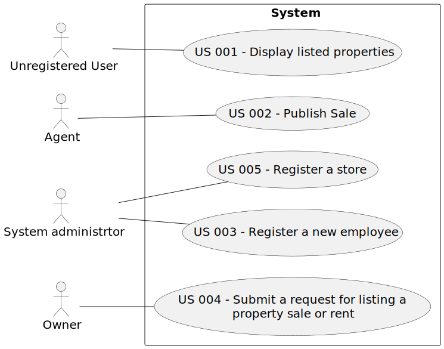

# Use Case Diagram (UCD)

# Use Cases / User Stories

| UC/US  | Description                                                                            |                   
|:-------|:---------------------------------------------------------------------------------------|
| US 001 | [US 001 - Display listed properties](../../sprintA/us001/Readme.md)                            |  
| US 002 | [US 002 - Publish any sale announcement on the system](../../sprintA/us002/Readme.md)          |     
| US 003 | [US 003 - Register a new employee](../../sprintA/us003/Readme.md)                              |                                             |
| US 004 | [US 004 - Submit a request for listing a property sale or rent](../../sprintA/us004/Readme.md) |                                            |
| US 005 | [US 005 - Register a store](../../sprintA/us005/Readme.md)                                     |        
