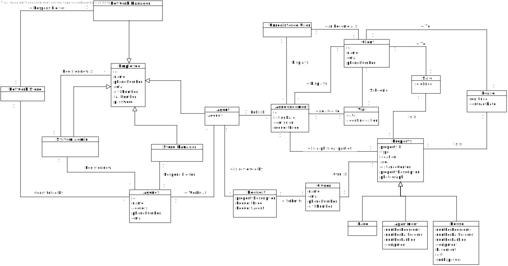

# Analysis

## Rationale to identify domain conceptual classes ##

### _Conceptual Class Category List_ ###

**Business Transactions**

* Sale
* Lease

---

**Product/Service related to a Transaction or Transaction Line Item**

* Properties 
  * Apartment
  * House
  * Land
* Announcement

---

**Roles of People or Organizations**

* Employee
  * Agent
  * System admin
  * Network manager
  * Store manager
* Client
* Unregistered user
* Owner

---

**Place of Service**

* Agency

---

**Noteworthy Events**

* Visit

---

**Physical Objects**

* Property 
  * Apartment
  * House
  * Land

---

**Containers**

* Network Store
* Agency

---

**Elements of Containers**
* Agency
*  Properties

---

**Documents that are regularly referred to in order to perform work**

*  Request

---

### Associations between conceptual classes ###

| Concept (A) 		        |                 Association   	                  |   Concept (B) |
|-----------------------|:------------------------------------------------:|--------------:|
| Agent	                |              Publish           		 	              |  Announcement |
| Agent 	               |                 is  a      		 	                  |      Employee |
| Agent 	               |           is a member of          		 	           |        Agency |
| Apartment 	           |                is a          		 	                |      Property |
| House 	               |                is a          		 	                |      Property |
| Land 	                |                is a          		 	                |      Property |
| 	 Lease 	             | is related with a Lease  of                 		 	 |      Property |
| 	 Lease 	             |   is related with a Lease to              		 	   |        Client |
| Network manager	      |          responsible for           		 	          | Network Store |
| Network manager	      |                  is  a    		 	                   |      Employee |
| Network Store         |                is Constituted by                 |        Agency |
| Owner	                |     uses or manages or own             		 	      |      Property |
| 	  Property	          |        is a physical part of         		 	        |  Announcement |
| Client  	             |                 displays   		 	                  |  Announcement |
| Client  	             |                 Schedules   		 	                 |         Visit |
| Request	              | is related with a Submition  of             		 	 |         Owner |
| Request 	  	          |          is reviewed by           		 	           |         Agent |
| 	 Sale 	              |  is related with a buy  of                 		 	  |      Property |
| 	 Sale 	              |  is related with a buy to                 		 	   |        Client |
| Store manager	        |                is  a         		 	                |      Employee |
| Store manager	        |        is responsible for           		 	         |       Agency	 |
| System admin 	        |                  is  a      	 	                  |      Employee |
| 	System admin 	       |                register a new	 	                 |        Agency |
| System admin 	        |                register a new	 	                 |      Employee |	
| Unregistered user	  	 |           can become a           		 	            |        Client |
| Unregistered user  	  |                  displays 		 	                   |  Announcement |
| 	  Visit	             |                  related to		 	                  |  Announcement |

## Domain Model

