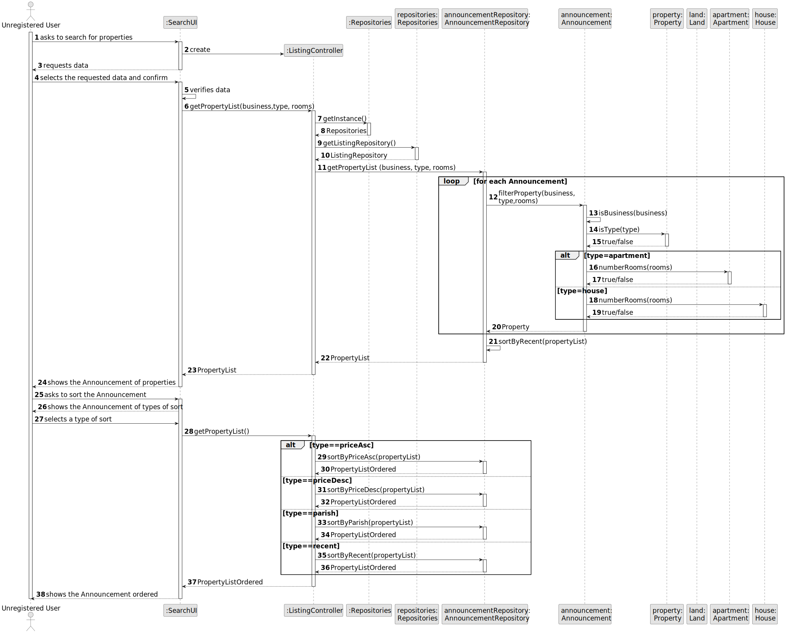
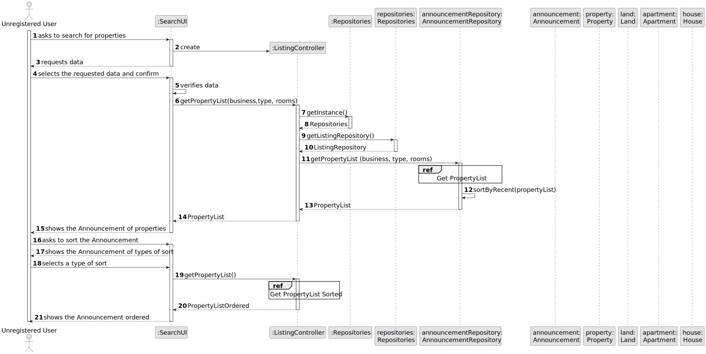
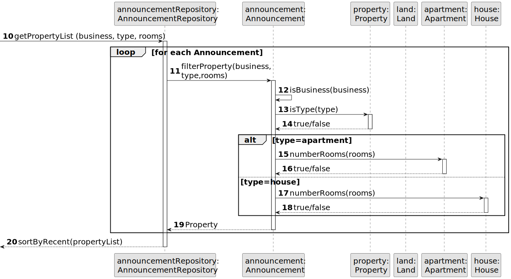
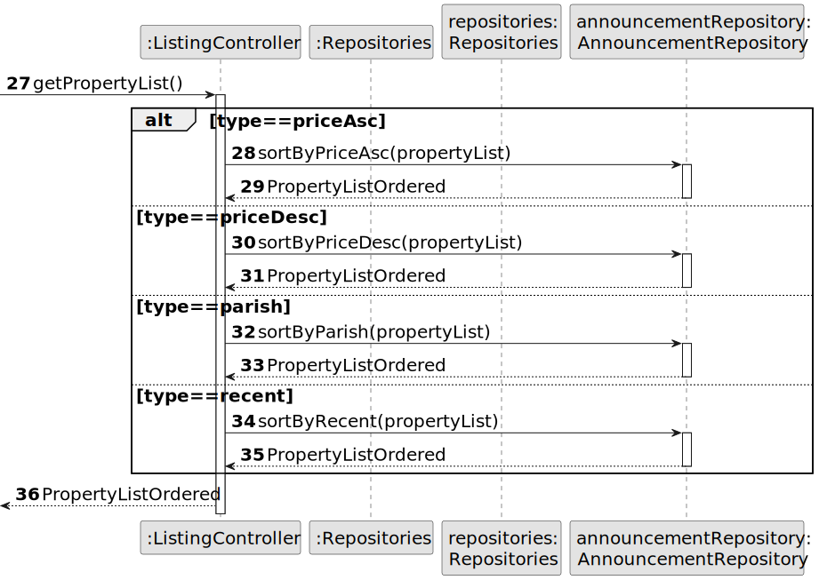
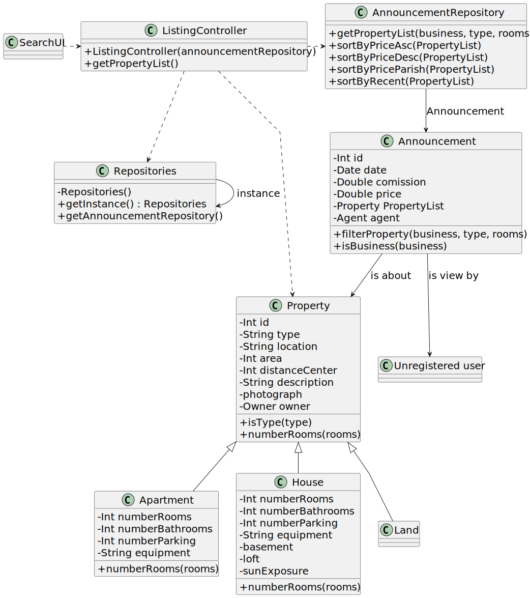

# US 001 - Display listed properties

## 3. Design - User Story Realization 

### 3.1. Rationale

| Interaction ID | Question: Which class is responsible for...         | Answer                 | Justification (with patterns)                                                                                 |
|:---------------|:----------------------------------------------------|:-----------------------|:--------------------------------------------------------------------------------------------------------------|
| Step 1  		     | 	... interacting with the actor?                    | SearchUI               | Pure Fabrication: there is no reason to assign this responsibility to any existing class in the Domain Model. |
| 		             | 	... coordinating the US?                           | ListingController      | Controller                                                                                                    |
| Step 2  		     | ... displaying the UI for the actor to input data?  | SearchUI               | Information Expert: is responsible for user interactions.                                                     |
| Step 3  		     | 	... validating input data?                         | SearchUI               | Pure Fabrication: Knows the data that actor inputs                                                            |
| 		             | 	... obtaining the listed properties list?          | AnnouncementRepository | Information Expert: know all its Announcements                                                                |
| Step 4  		     | 	... displaying the list for the actor?             | SearchUI               | Information Expert: is responsible for user interactions.                                                     |
| Step 5  		     | 	... obtaining the listed properties list ordered?  | AnnouncementRepository | Information Expert: know all its Announcements                                                                |
| Step 6  		     | 	... displaying all the list ordered for the actor? | SearchUI               | Information Expert: is responsible for user interactions.                                                     |

### Systematization ##

According to the taken rationale, the conceptual classes promoted to software classes are: 

 * AnnouncementRepository

Other software classes (i.e. Pure Fabrication) identified: 

 * SearchUI
 * ListingController

## 3.2. Sequence Diagram (SD)

### Alternative 1 - Full Diagram

This diagram shows the full sequence of interactions between the classes involved in the realization of this user story.

### Alternative 2 - Split Diagram

This diagram shows the same sequence of interactions between the classes involved in the realization of this user story, but it is split in partial diagrams to better illustrate the interactions between the classes.

It uses interaction ocurrence.

**Get Property List**

**Get Property List Sorted**

## 3.3. Class Diagram (CD)

