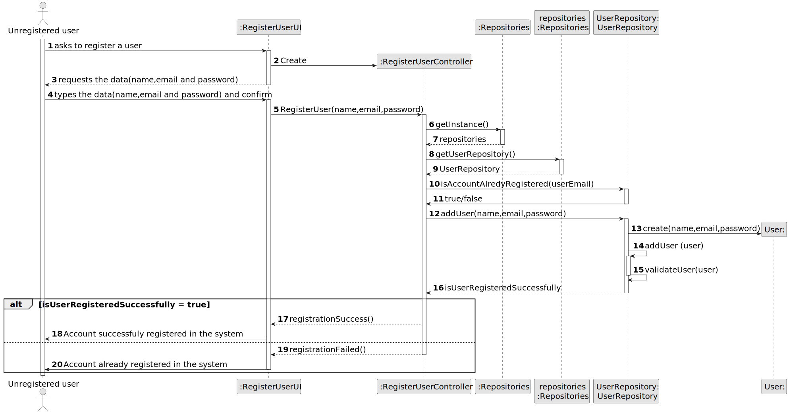
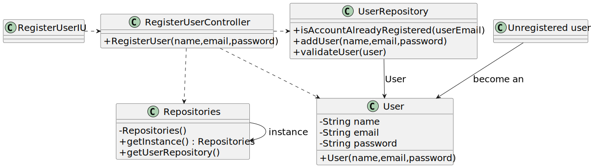

# US 007 - Register user in the system

## 3. Design - User Story Realization 

### 3.1. Rationale

| Interaction ID | Question: Which class is responsible for...               | Answer                 | Justification (with patterns)                                                                                 |
|:---------------|:----------------------------------------------------------|:-----------------------|:--------------------------------------------------------------------------------------------------------------|
| Step 1  		     | 	... interacting with the actor?                          | RegisterUserUI         | Pure Fabrication: there is no reason to assign this responsibility to any existing class in the Domain Model. |
| 			  		        | 	... coordinating the US?                                 | RegisterUserController | Controller                                                                                                    |
| 			  		        | 	... instantiating a new user?                            | UserRepository         | Creator: UserRepository has a list of Users.                                                                  |
| Step 2  		     | 	... displaying the UI for the actor to input data?						 | RegisterUserUI         | Information Expert: is responsible for user interactions.                                                     |
| Step 3  		     | 	...saving the inputted data?                             | User                   | Information Expert: object created in step 1 has its own data.                                                |
| Step 4  		     | 	... validating all data (local validation)?              | UserRepository         | Information Expert: owns its data.                                                                            |
| Step 5  		     | 	... register user in the system?                         | User                   | Information Expert: knows its own data                                                                        |
| Step 6  		     | 	... informing operation success?                         | RegisterUserUI         | Information Expert: is responsible for user interactions.                                                     |

### Systematization ##

According to the taken rationale, the conceptual classes promoted to software classes are: 

 * UserRepository
 * User

Other software classes (i.e. Pure Fabrication) identified: 

 * RegisterUserUI  
 * RegisterUserController

## 3.2. Sequence Diagram (SD)

### Alternative 1 - Full Diagram

This diagram shows the full sequence of interactions between the classes involved in the realization of this user story.

## 3.3. Class Diagram (CD)

