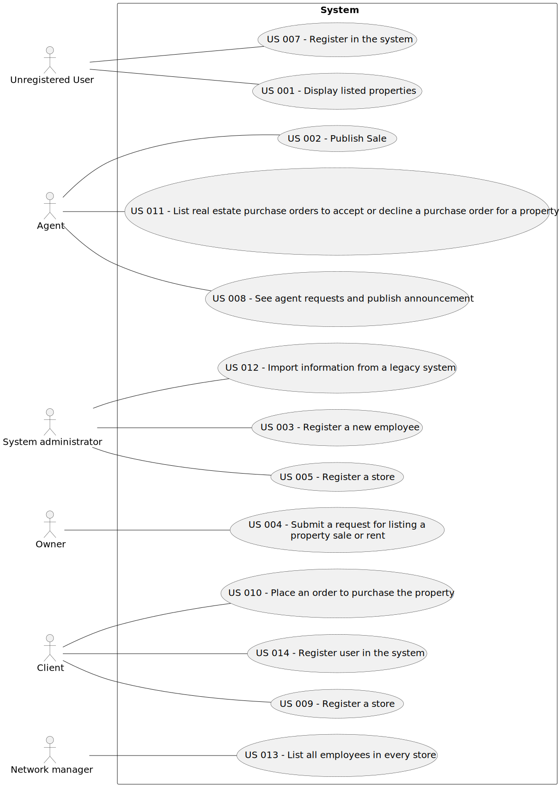

# Use Case Diagram (UCD)

# Use Cases / User Stories

| UC/US  | Description                                                                                                                     |                   
|:-------|:--------------------------------------------------------------------------------------------------------------------------------|
| US 001 | [US 001 - Display listed properties](../../sprintB/us001/Readme.md)                                                             |  
| US 002 | [US 002 - Publish any sale announcement on the system](../../sprintB/us002/Readme.md)                                           |     
| US 003 | [US 003 - Register a new employee](../../sprintB/us003/Readme.md)                                                               |                                             |
| US 004 | [US 004 - Submit a request for listing a property sale or rent](../../sprintB/us004/Readme.md)                                  |                                            |
| US 005 | [US 005 - Register a store](../../sprintB/us005/Readme.md)                                                                      |        
| US 007 | [US 007 - Register user in the system](../../sprintB/us007/Readme.md)                                                           |        
| US 008 | [US 008 - See agent requests and publish announcement](../../sprintB/us008/Readme.md)                                           |        
| US 009 | [US 009 - Register a store](../../sprintB/us009/Readme.md)                                                                      |        
| US 010 | [US 010 - Place an order to purchase the property](../../sprintB/us010/Readme.md)                                               |        
| US 011 | [US 011 - List real estate purchase orders to accept or decline a purchase order for a property](../../sprintB/us011/Readme.md) |        
| US 012 | [US 012 - Import information from a legacy system](../../sprintB/us012/Readme.md)                                               |        
| US 013 | [US 013 - List all employees in every store](../../sprintB/us013/Readme.md)                                                     |        
| US 014 | [US 014 - Register user in the system](../../sprintB/us014/Readme.md)                                                           |        
