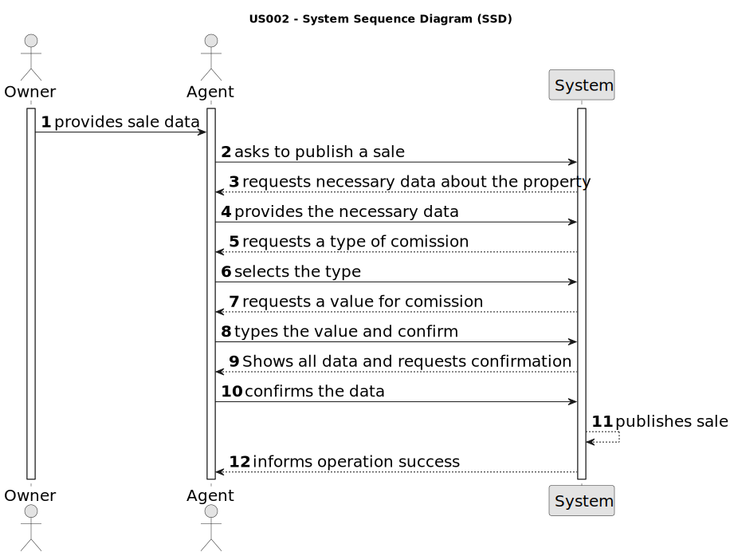

# US 0002 - Publish any sale announcement on the system

## 1. Requirements Engineering

### 1.1. User Story Description

As an agent, I can publish any sale announcement on the system, for
example received through a phone call.

### 1.2. Customer Specifications and Clarifications 

**From the specifications document:**

> The real estate agent reviews advertisement requests, registers the information in the system and
publishes the offer so that it is visible to all clients who visit the agency and use the application. All
registered information, except the agency commission, can be accessed by the client who intends to
buy or rent the property; the client is, then, responsible for being able to consult the properties by
type, number of rooms, and sort by criteria such as price or the parish where the property is located.

**From the client clarifications:**

>**Question:** I'm having a little issue defining what the sun exposure might be.
I'm not sure what it will be as a value. If it's a number that defines how much exposure
the house has or if it is just a text saying if it has or doesn't have sun exposure.
>>**Answer:** Sun exposure takes the values North, South, East and West.

>**Question:** Are there any restrictions on the choice of agent?
>>**Answer:** No.

>**Question:** How does the agent determine whether it is a fixed commission
or a percentage commission?
>>**Answer:** The agent should choose the type of commission and enter the value.

>**Question:** In case it is on an agency, must the agent be assigned automatically by the system?
>>**Answer:** The agent that registers the information in the system 
can choose to assign any agent.

>**Question:** When the agent receives the phone call (as mentioned in US002) is it the agent who registers the order in the system or has the order already been entered into the system by the owner? Or is the phone call just for the owner to tell the agent that he registered a request in the system?
>>**Answer:** The agent registers the order in the system.

>**Question:** In one of the previous questions you have stated that for now the only way that a agent can receive the request to publish an announcement is through a phone call, however in the primary data necessary to create an announcement it's said that it's necessary to upload at least one photo of the property. Taking that into consideration, the announcement can't be fully made by only communicating with the owner through a phone call, how is it possible for an agent to publish an announcement without all the necessary data?
>>**Answer:** The owner can send the photograph by e-mail or any other means. The owner can even deliver the photograph to the store.

>**Question:** Another doubt that has emmerged is related to the identification of the owner of the property, isn't it required that the owner identifies themselves in the announcement ?
>>**Answer:** Info about the owner is not published.

>**Question:** Is it mandatory for the agent to input the commission value before publishing an announcement?
>>**Answer:** Yes.

>**Question:** Are there only 2 types of commission or can the Administrator define more types of commission?
>>**Answer:** For now we only have two types of commissions.

>**Question:** Is it necessary to publish the owner atributes on the sale announcement?
>>**Answer:** No.

>**Question:** If the comission is percentage[/value] what is the value? Is it the same for all agents?
>>**Answer:** There is no maximum and the minimum is 0. The commission is for the agency and for that given property.

>**Question:** If it's a property for lease is the comission value adjusted for the monthly value and contract duration? What is the value or method for calculating the comission?
>>**Answer:** The commission is one value/percentage paid when the transaction is made.

### 1.3. Acceptance Criteria

- **AC1:** The agent must be authenticated in the system.
- **AC2:** The sale data must be validated by the system.
- **AC3:** The sale request must be validated by the agent.
- **AC4:** The sale is visible on the system according to its category.
- **AC5:** The sale can be accessed on the system.

### 1.4. Found out Dependencies

- Dependency with US4: "As an owner, I intend to submit a request
for listing a property sale or rent, choosing the responsible agent."
There is a dependency with the US4 since the agent can receive a request,
from a phone call, or the application itself. Once he receives that
request he validates the data.

### 1.5 Input and Output Data

**Input Data:**

- Type of property
Property area
- Agent commission
- Location 
- Distance from city centre
- Price
- Property photos
- Number of bedrooms bathrooms and parking spaces
- Available equipment
- Existence of basement
- Existence of inhabitable loft 
- Sun exposure

**Output Data:**
- Success operation message
- An announcement with input data except the agent commission.

### 1.6. System Sequence Diagram (SSD)

### 1.7 Other Relevant Remarks
* **Brief format :**
  * An agent receive a call from an owner to publish an announcement about a property. After he receives the data, the agent
   asks to the system to insert a new Announcement and the system request the data relative to the property and the sale. 
   After confirmation the system shows all the input data and asks for confirmation.Then the system asks for a type of comission, the agent select one, insert the value and confirm. After confirmation, the system publish
   the sale and informs the Agent of the success.