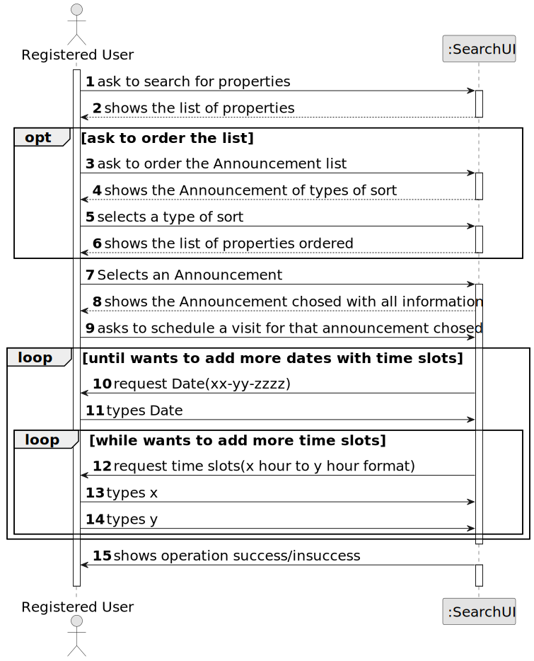

# US 009 - Register a store 

## 1. Requirements Engineering

### 1.1. User Story Description

US9: As a client, I want to leave a message to the agent to schedule a visit to a
property of my interest.

### 1.2. Customer Specifications and Clarifications 

**From the specifications document:**

**From the client clarifications:**

> **Question:** Can the client make multiple schedules in a single message for different properties, or can they only have 1 property per message with multiple schedules?
>
>> **Answer:** The client can only schedule a visit to one property at a time. Each time the client schedules a visit, the client should specify, for each day, one or multiple time slots. The time slots should not overlap.
If the client wants to visit more properties, the client should use/run again the visit scheduling feature available in the system.

> **Question:** When writing the information to schedule a meeting with the agent, the preferred date and the time slot of the visit should be checked. The client can choose any day of the year? And any time of the day? 
>  
>> **Answer:** Any date and time can be specified. We are always available to our customers!

> **Question:** Q: The client can make multiple schedules in a single message?
> 
>> **Answer:**  Every time the client makes use of this feature of the system, the client can specify multiple date/time slots.

> **Question:** In AC2, when the suggestion of date and time is sent, is there a standard duration for the visit or is it mandatory to fill in a start time and an end time for the visit?
>
>> **Answer:** There is no standard duration to schedule a visit. The client should define his availability specifying the start time and the end time for the visit.

### 1.3. Acceptance Criteria

* **AC1:** A list of available properties must be shown, sorted from the most recent entries to the oldest.
* **AC2:** The message must also include the client's name, phone number,preferred date and time slot (from x hour to y hour) for the property visit.
* **AC3:** A client may post multiple visit requests, but only if those do not overlap each other.
* **AC4:** The client must receive a success message when the request is valid and registered in the system.

### 1.4. Found out Dependencies

* Us001

### 1.5 Input and Output Data

**Input Data:**

* Typed data:
	* preferred date 
    * time slot
    * announcementId
* Selected data:
    
   
	

**Output Data:**

* (In)Success of the operation

### 1.6. System Sequence Diagram (SSD)

### 1.7 Other Relevant Remarks
