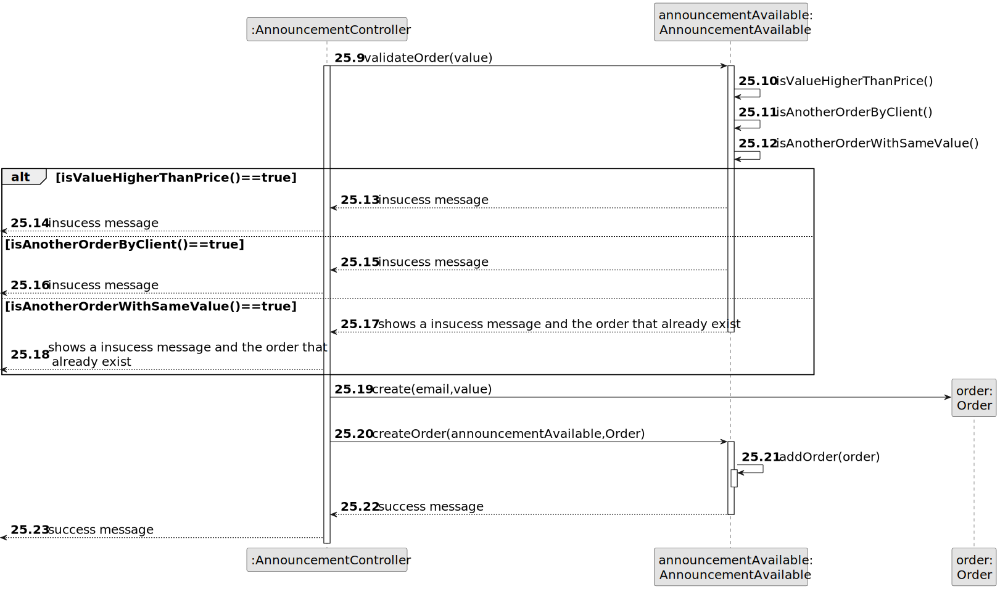

# US 010 - Place an order to purchase the property

## 3. Design - User Story Realization 

### 3.1. Rationale

| Interaction ID | Question: Which class is responsible for...                  | Answer                 | Justification (with patterns)                                                                                 |
|:---------------|:-------------------------------------------------------------|:-----------------------|:--------------------------------------------------------------------------------------------------------------|
| Step 1  		     | 	... interacting with the actor?                             | SearchUI               | Pure Fabrication: there is no reason to assign this responsibility to any existing class in the Domain Model. |
| 		             | 	... coordinating the US?                                    | AnnouncementController | Controller                                                                                                    |
| Step 2  		     | 		                                                           |                        |                                                                                                               |
| Step 3  		     | 	... displaying the UI for the actor to input data?          | SearchUI               | IE: is responsible for user interactions.                                                                     |
| Step 4  		     | 	                                                            |                        |                                                                                                               |
| Step 5  	      | ... displaying the UI for the actor to input data?           | SearchUI               | IE: is responsible for user interactions.                                                                     |
| Step 6  		     | 	                                                            |                        |                                                                                                               |
| Step 7		       | ... displaying the UI for the actor to input data?           | SearchUI               | IE: is responsible for user interactions.                                                                     |
| Step 8	 		     | 	... obtaining the listed properties list?                   | AnnouncementRepository | Information Expert: know all its Announcements                                                                |
| 	 		           | 	... Convert List to DTO?                                    | AnnouncementMapper     | Information Expert: know all its Announcements                                                                |
| Step 9	 		     | ... displaying the UI for the actor to input data?           | SearchUI               | IE: is responsible for user interactions.                                                                     |
| Step 10  		    | 	                                                            |                        |                                                                                                               |
| Step 11  		    | 	... displaying the UI for the actor to input data?          | SearchUI               | IE: is responsible for user interactions.                                                                     |
| Step 12  		    | 	... obtaining the listed properties list?                   | AnnouncementRepository | Information Expert: know all its Announcements                                                                |
| 		             | 	 ... displaying the announcement list sorted for the actor? | SearchUI               | IE: is responsible for user interactions.                                                                     |
| Step 13  		    | 	... obtaining the listed properties list?                   | AnnouncementRepository | Information Expert: know all its Announcements                                                                |
| 		             | 	 ... displaying the announcement list sorted for the actor? | SearchUI               | IE: is responsible for user interactions.                                                                     |
| Step 14  		    | 	... obtaining the listed properties list?                   | AnnouncementRepository | Information Expert: know all its Announcements                                                                |
| 		             | 	 ... displaying the announcement list sorted for the actor? | SearchUI               | IE: is responsible for user interactions.                                                                     |
| Step 15  		    | 	... obtaining the listed properties list?                   | AnnouncementRepository | Information Expert: know all its Announcements                                                                |
| 		             | 	 ... displaying the announcement list sorted for the actor? | SearchUI               | IE: is responsible for user interactions.                                                                     |
| Step 16  		    | 	... displaying the UI for the actor to input data?          | SearchUI               | IE: is responsible for user interactions.                                                                     |
| Step 17  		    | 	... displaying the Announcement?                            | SearchUI               | IE: is responsible for user interactions.                                                                     |
| 		             | 	... get the announcement info for announcement choosed?     | AnnouncementAvailable  | IE: knows all its information                                                                                 |
| Step 18  		    | 	... displaying the UI for the actor to input data?          | SearchUI               | IE: is responsible for user interactions.                                                                     |
| Step 19  		    | 	                                                            |                        |                                                                                                               |
| Step 20  		    | 	... get client email?                                       | UserSession            | IE: knows the user authenticated in the system                                                                |
| 		             | 	... validate order?                                         | AnnouncementAvailable  | IE: knows all the data.                                                                                       |
| 		             | 	... create order?                                           | AnnouncementAvailable  | IE: is responsible for create order and add.                                                                  |
| 		             | 	... informing operation success?                            | SearchUI               | IE: is responsible for user interactions.                                                                     |
| Step 21  		    | 	... informing operation insuccess?                          | SearchUI               | IE: is responsible for user interactions.                                                                     |
| Step 22  		    | 	... informing operation insuccess?                          | SearchUI               | IE: is responsible for user interactions.                                                                     |
| Step 23  		    | 	... informing operation insuccess?                          | SearchUI               | IE: is responsible for user interactions.                                                                     |
| Step 24  		    | 	... informing operation insuccess?                          | SearchUI               | IE: is responsible for user interactions.                                                                     |

### Systematization ##

According to the taken rationale, the conceptual classes promoted to software classes are: 

 * Announcement
 * UserSession
 * Order
 * Property
 * AnnouncementMapper
 * OrderMapper
 * announcementDTO
 * AnnouncementRepository

Other software classes (i.e. Pure Fabrication) identified: 

 * SearchUI  
 * AnnouncementController

## 3.2. Sequence Diagram (SD)

### Alternative 1 - Full Diagram

This diagram shows the full sequence of interactions between the classes involved in the realization of this user story.

### Alternative 2 - Split Diagram

This diagram shows the same sequence of interactions between the classes involved in the realization of this user story, but it is split in partial diagrams to better illustrate the interactions between the classes.

It uses interaction ocurrence.

**Get Announcement Available List**

**Sort Announcement Available List**

**Get Announcement Available id**

**Get Client Session**

**Validate and Create Order**

## 3.3. Class Diagram (CD)

