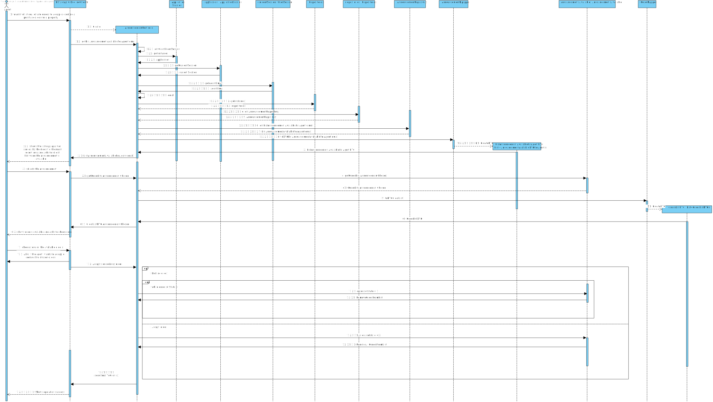
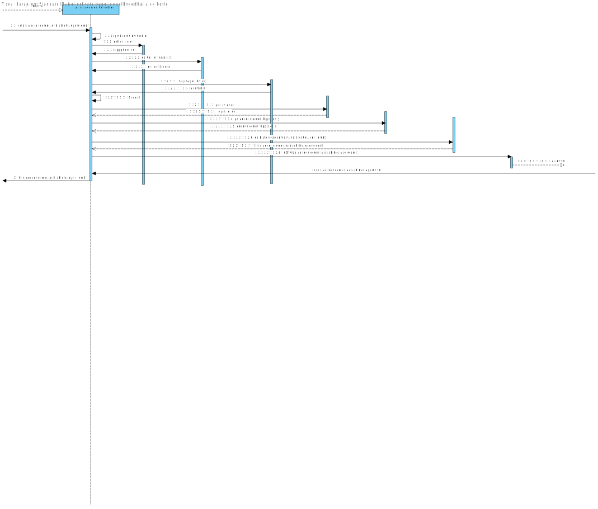
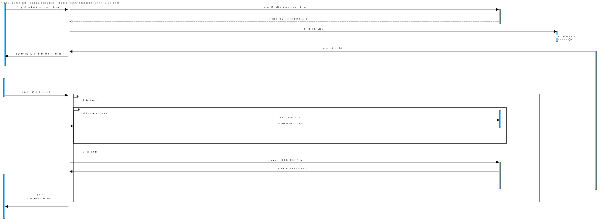

# US 011 - List real estate purchase orders to accept or decline a purchase order for a property

## 3. Design - User Story Realization 

### 3.1. Rationale

| Interaction ID | Question: Which class is responsible for... | Answer                                    | Justification (with patterns)                                                                                 |
|:---------------|:--------------------------------------------|:------------------------------------------|:--------------------------------------------------------------------------------------------------------------|
| Step 1  		     | 	...interacting with the Agent?					        | ListAcceptOrDeclineOffersUI               | Pure Fabrication: there is no reason to assign this responsibility to any existing class in the Domain Model. |
|                | ...coordinating the US?	                    | AnnouncementController                    | Controller                                                                                                    |
|                | ... knowing the user using the system?      | UserSession                               | Information Expert: cf. A&A component documentation.                                                          |
| Step 2 		      | 	...saving inputted data                    | AnnouncementsAvailable / AnnoucementsSold | Information Expert: knows it own data.                                                                                        | 
| Step 3 		      | 	...validating all data(local validation)?  | AnnouncementsAvailable / AnnoucementsSold | Information Expert: owns its data.                                                                                            |
|                | ...validating all data (global validation)? | AnnouncementController                               | Information Expert: knows all its requests.                                                                                   |
|                | ...saving the status of the order           | AnnoucementRepository                     | Information Expert: owns all its stores.                                                                                      |
| Step 4 		      | ...informing operation success							       | ListAcceptOrDeclineOffersUI               | Information Expert: is responsible for user interactions.                                                                     |

### Systematization ##

According to the taken rationale, the conceptual classes promoted to software classes are: 

 * AnnouncementRepository

Other software classes (i.e. Pure Fabrication) identified: 

 * ListAcceptOrDeclineOffersUI
 * AnnouncementController

## 3.2. Sequence Diagram (SD)

### Alternative 1 - Full Diagram

This diagram shows the full sequence of interactions between the classes involved in the realization of this user story.

### Alternative 2 - Split Diagram

This diagram shows the same sequence of interactions between the classes involved in the realization of this user story, but it is split in partial diagrams to better illustrate the interactions between the classes.

It uses interaction ocurrence.

## 3.3. Class Diagram (CD)

