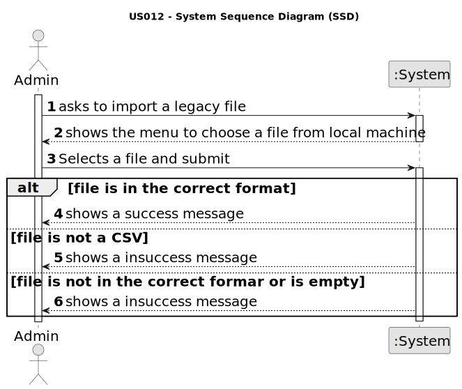

# US 012 - import information from a legacy system

## 1. Requirements Engineering

### 1.1. User Story Description

As a system administrator, I want to import information from a legacy
system that has been in use in several agencies.

### 1.2. Acceptance Criteria

* **AC1:** The system administrator must be able to choose a file to import.
* **AC2:**   The system should only accept CSV files.
* **AC3:** The file content must be validated, showing a message to the system
  administrator if the file is empty or its content is not in the requested format.
  the previous one is declined.
* **AC4:** The import operation, when successful, should trigger a success message to
    the system administrator.

### 1.3. Found out Dependencies

* None dependency

### 1.4 Input and Output Data

**Input Data:**

* Selected data:
    * Input file

**Output Data:**

* Success/insuccess message

### 1.5. System Sequence Diagram (SSD)

