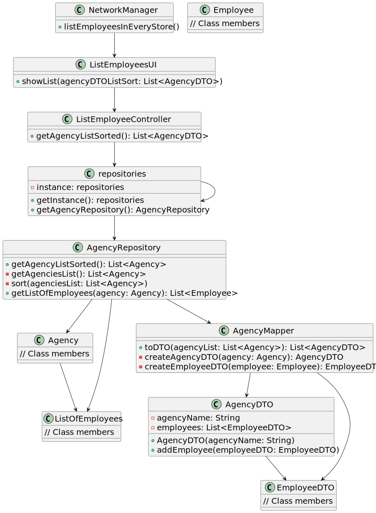
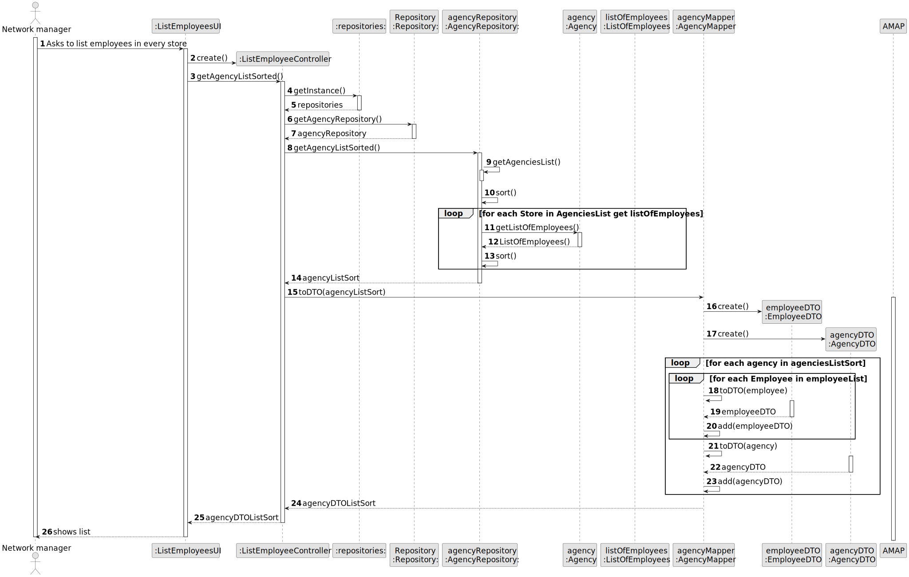

# US 013 - Show Employees

## 3. Design - User Story Realization

### 3.1. Rationale

**SSD - Alternative 1 is adopted.**

| Interaction ID | Question: Which class is responsible for... | Answer               | Justification (with patterns)                                                                                 |
|:-------------  |:--------------------- |:---------------------|:--------------------------------------------------------------------------------------------------------------|
| Step 1  		 |	... interacting with the actor? | ListEmployeesUI         | Pure Fabrication: there is no reason to assign this responsibility to any existing class in the Domain Model. |
| 			  		 |	... coordinating the US? | ListEmployeesController | Controller   |
| 			  		 |	... instantiating a new employee? | AgencyRepository         | Creator                                                          | | |
|  		 |	...knowing all agencies?|   AgencyRepository   | IE:AgencyRepository knows all agencies|
| |...knowing all employees in each agency|ListOfEmployees|IE:ListOfEmployees contains all employees in an agency|
|		 |... transfer data of the domain to the UI?| AgencyDTO                | DTO: When there is so much data to transfer, it is better to opt by using a DTO in order to reduce coupling between UI and domain.  |
| 	 |... mapping the transferred ?|AgencyMapper|Creator: sits between the domain and the DTO							 |                      |                
| 		 	| ...Showing the employees              |        ShowEmployeesUI|Pure Fabrication: there is no reason to assign this responsibility to any existing class in the Domain Model.|
| Step 2|	| |                                                        |                  |                                                                                                               |              

### Systematization ##

According to the taken rationale, the conceptual classes promoted to software classes are:

* Employee
* Agency

Other software classes (i.e. Pure Fabrication) identified:

* ShowEmployeeUI
* ShowEmployeeController
* Repositories
* AgencyRepositories
* AgencyMapper
* AgencyDTO
* EmployeeDTO
* ListOfEmployees

## 3.2. Sequence Diagram (SD)

### Alternative 1 - Full Diagram

This diagram shows the full sequence of interactions between the classes involved in the realization of this user story.

## 3.3. Class Diagram (CD)

