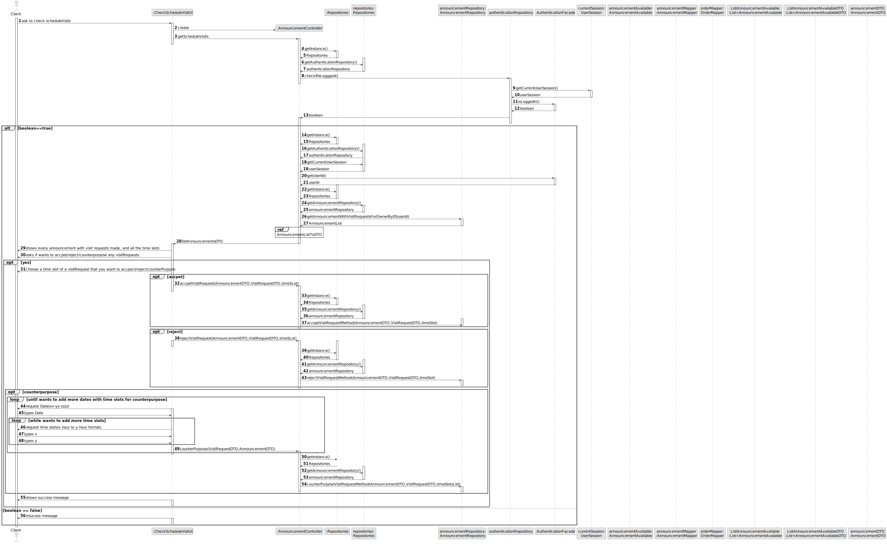

# US 014 - As a client, I want to read the response for the appointment requests, to accept or reject it

## 3. Design - User Story Realization 

### 3.1. Rationale

| Interaction ID | Question: Which class is responsible for...           | Answer                       | Justification (with patterns)                                                                                 |
|:---------------|:------------------------------------------------------|:-----------------------------|:--------------------------------------------------------------------------------------------------------------|
| Step 1  		     | 	... interacting with the actor?                      | SearchUI                     | Pure Fabrication: there is no reason to assign this responsibility to any existing class in the Domain Model. |
| 		             | 	... coordinating the US?                             | CheckScheduleVisitController | Controller                                                                                                    |
| 		             | ... knowing the user using the system?                | UserSession                  | IE: cf. A&A component documentation.                                                                          |
| Step 2  		     | 	... displaying the UI for the actor to input data?   | CheckScheduleVisitsUI        | IE: is responsible for user interactions.                                                                     |
| Step 3  		     | 	... receiving the input data?                        | CheckScheduleVisitsUI        | IE: is responsible for user interactions.                                                                     |
| 		             | 	... knowing the announcements to show?               | Announcement                 | IE: Announcements are showed based on user search.                                                            |
| Step 4  		     | 	... displaying the announcement list for the actor?  | CheckScheduleVisitsUI                     | IE: is responsible for user interactions.                                                                     |
| Step 5	 		     | ... knowing the selected Announcement ?               | AnnouncementRepository       | IE: knows all its announcements                                                                               |
|                | ...   knowing the visitRequestSelected                | Announcement                 | IE: know all its visiRequests                                                                                 |
|                | ... knowing the user using the system?                | UserSession                  | IE: cf. A&A component documentation.                                                                          |
| Step 6  		     | 	... displaying the UI for the actor to input data?   | CheckScheduleVisitsUI        | IE: is responsible for user interactions.                                                                     |
| Step 7  		     | 	... validating all data (local validation)?          | AnnouncementRepository       | IE: owns its data.                                                                                            |
|                | ... saving the option chosed?                         | Announcement                 | IE: owns all its Announcements                                                                                |
|                | ... knowing the client that is using the system? | UserSession                  | IE: cf. A&A component documentation.                                                                          |
| Step 8  		     | 	... informing operation success?                     | CheckScheduleVisitsUI                      | IE: is responsible for user interactions.                                                                     |

### Systematization ##

According to the taken rationale, the conceptual classes promoted to software classes are: 

 * Announcement
 * UserSession

Other software classes (i.e. Pure Fabrication) identified: 

 * ScheduleVisitController
 * CheckScheduleVisitUI

## 3.2. Sequence Diagram (SD)

### Alternative 1 - Full Diagram

This diagram shows the full sequence of interactions between the classes involved in the realization of this user story.

