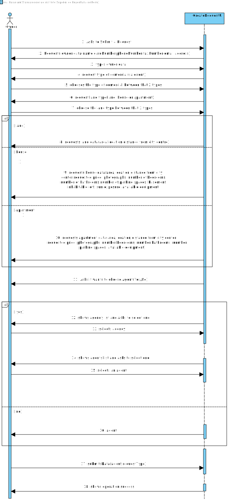

# US 004 - Submit a request for listing a property sale or rent

## 1. Requirements Engineering

### 1.1. User Story Description

As an owner, I intend to submit a request for listing a property sale or rent, choosing the responsible agent.

### 1.2. Customer Specifications and Clarifications 

**From the specifications document:**
>From time to time, property owners contact Real Estate USA with the aim of selling or renting their
properties. Owners go to one of the company's branches and meet with a real estate agent to sell or
rent one or more properties, or they can use the company's application for the same purposes. The
owner provides property characteristics and the requested price and sends the request to an agent.
Upon receiving the order, the agent sets the commission and publishes the offer in the system. The
commission can be a fixed amount or a percentage. In the case of a request for the sale of a
property, the owner must provide information on: the type of property (apartment, house or land),
the area in m2, the location, the distance from the city centre, the requested price and one or more
photographs. If the property is an apartment or a house, the owner also provides: the number of
bedrooms, the number of bathrooms, the number of parking spaces and the available equipment,
such as central heating and/or air conditioning. In case the property is a house, the existence of a
basement, an inhabitable loft, and sun exposure must be registered as well.

**From the client clarifications:**
>**Question:** If the owner doesn't select an agent will the platform randomly assign one or the request cannot move to revision? If not, must we assume that all information slots must be filled?
>>**Answer:** Thank you for your suggestion. When filling the property data, the owner should select one agent from the list of agents working in the selected agency. Moreover, the application should include a feature to randomly assign one agent. The address of the owner is not mandatory.

>**Question:** When renting, does the owner have any space to clarify any prohibitions or obligations with the property?
>>**Answer:** No.

>**Question:** Does the owner have a limit of requests they can do?
>>**Answer:** No.

>**Question:** Regarding the property’s photographs, is that considered selected data?
>>**Answer:** The owner should input the URI of each file/photograph.

>**Question:** In the case of listing a land property, shall the owner refer if there is a building permit already approved?
>>**Answer:** No.

>**Question:** When assigning an agent to a property listing, are the available agents shown by the system for the owner to pick? Or does the owner need to provide the agent's information (name, agency,etc)?
>>**Answer:** The owner should select one agent from a list of agents that work in the selected agency. The owner should select the agency before selecting the agent.

>**Question:** Does an owner need to be registered in the system to submit a request for a property listing?
>>**Answer:** No. When making the request to list a property, the owner should introduce his own data. The Owner attributes are: the name, the citizen's card number, the tax number, the address, the email address and the telephone number.

>**Question:** Also another question, when publishing a property, if the owner leaves the listing unfinished, can it be saved or stay as as a sketch to be finished later ?
>>**Answer:** No.

### 1.3. Acceptance Criteria

* **AC1:** All required fields must be filled in.
* **AC2** A agent needs to be selected if owner choose to select the agent

### 1.4. Found out Dependencies

Dependency with US2: "As an agent, I can publish any sale announcement on the system, for example received through a phone call." There is a dependency with the US2 since the owner needs that agent review the request to publish the announcement
Dependency with US3: "As a system administrator, I want to register a new employee."

### 1.5 Input and Output Data

**Input Data:**

* Typed data:
    * Requested price
    * Owner data

* Selected data:
    * Agent
    * Property characteristics
    * Agency
    * Business type

**Output Data:**

* Success of the operation

### 1.6. System Sequence Diagram (SSD)

### 1.7 Other Relevant Remarks

* Brief format:
  * An Owner asks to the system to submit a request and the system request the Owner data (name, phone number and email).
The Owner submits the data and select the type of business and property characteristics, types the requested price and 
submits. Then the system shows a list of agencys and asks to owner to select one. After he chooses, the system asks if the owner intends to choose an agent, and he selects an agent from a list that system shows 
to the owner. Then the system apresents all the data to the owner and he submits the data. At the end the system shows a
success message.