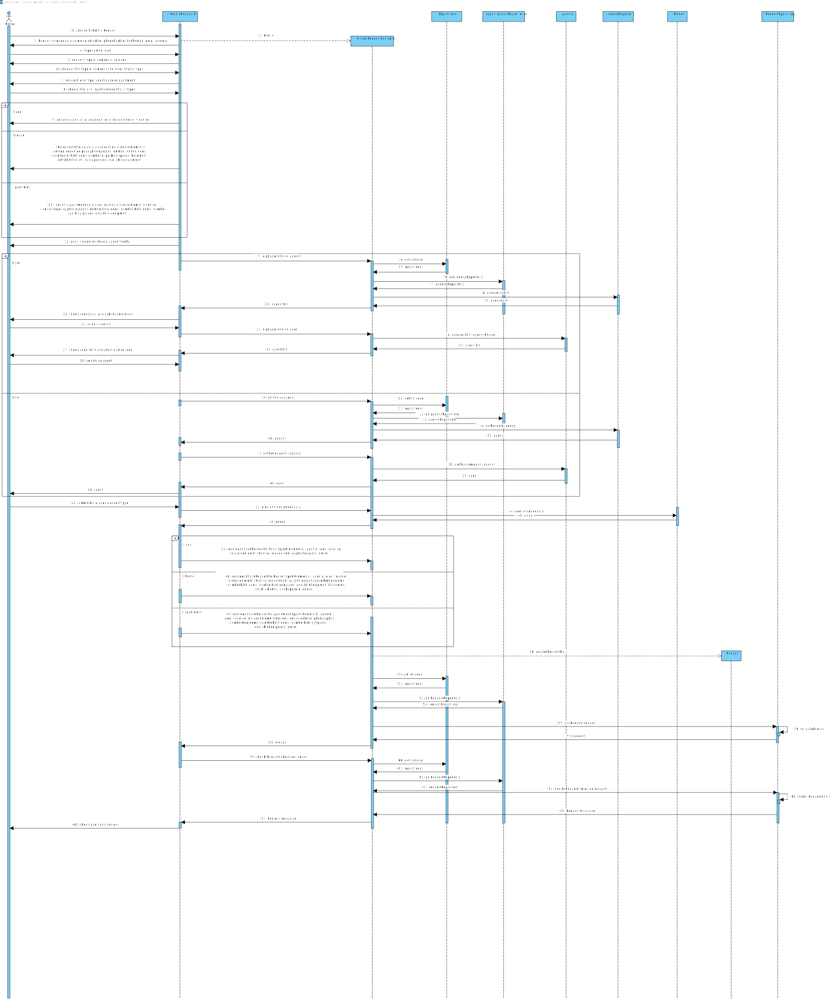
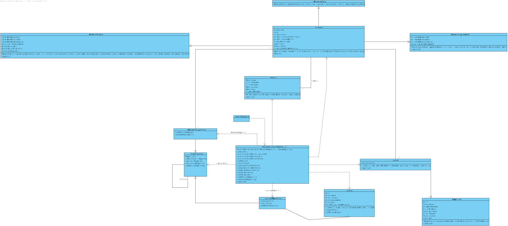

# US 004 - Submit a request for listing a property sale or rent

## 3. Design - User Story Realization 

### 3.1. Rationale

| Interaction ID | Question: Which class is responsible for...           | Answer                  | Justification (with patterns)                                                                                 |
|:---------------|:------------------------------------------------------|:------------------------|:--------------------------------------------------------------------------------------------------------------|
| Step 1  		     | 	... interacting with the actor?                      | CreateRequestUI         | Pure Fabrication: there is no reason to assign this responsibility to any existing class in the Domain Model. |
| 			  		        | 	... coordinating the US?                             | CreateRequestController | Controller                                                                                                    |
| Step 2  		     | 		displaying the UI for the actor to input data?					 | CreateRequestUI         | Information Expert: is responsible for user interactions.                                                     |
| Step 3  		     | 	validating input data?                               | CreateRequestUI         | Pure Fabrication: Knows the data that actor inputs                                                            |                                                        |
| Step 5  		     | 	obtaining the agency list                            | Agency Repository       | Information Expert: knows all its Agencies                                                                    |
| Step 6  		     | 		... displaying the list for the actor?					         | CreateRequestUI         | Information Expert: is responsible for user interactions.                                                     |              
| Step 7  		     | 	adding request to a chosen agency                    | createRequestUI         | IE: owns its data.                                                                                            | 
| 			  		        | 	... validating all data (global validation)?         | RequestRepository       | IE: knows all its requests.                                                                                   | 
| 			  		        | 	... saving the created request?                      | RequestRepository       | IE:owns all its requests.                                                                                     | 
| Step 8  		     | 	... informing operation success?                     | CreateRequestUI         | Information Expert: is responsible for user interactions.                                                     | 

### Systematization ##

According to the taken rationale, the conceptual classes promoted to software classes are: 

 * Request
 * Agency
 * Agent
 * Owner

Other software classes (i.e. Pure Fabrication) identified: 

 * CreateRequestUI  
 * CreateRequestController

## 3.2. Sequence Diagram (SD)

### Alternative 1 - Full Diagram

This diagram shows the full sequence of interactions between the classes involved in the realization of this user story.

## 3.3. Class Diagram (CD)

