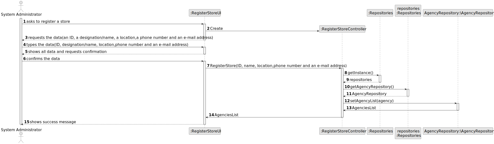
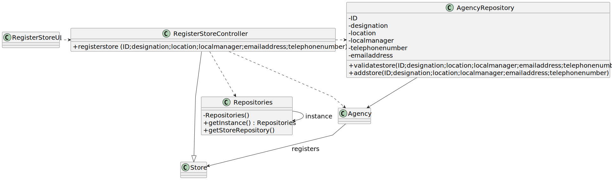

# US 005 - Register a store

## 3. Design - User Story Realization

### 3.1. Rationale

**SSD - Alternative 1 is adopted.**

| Interaction ID | Question: Which class is responsible for...         | Answer                     | Justification (with patterns)                                                                                 |
|:---------------|:----------------------------------------------------|:---------------------------|:--------------------------------------------------------------------------------------------------------------|
| Step 1  		 | 	...interacting with the System administrator       | RegisterStoreUI            | Pure Fabrication: there is no reason to assign this responsibility to any existing class in the Domain Model. |
|                | ...coordinating the US?	                           | RegisterStoreController | Controller                                                                                                    |
|                | ...instantiating a new Store?		               | Agency                     |                                                                                                               |
| Step 2		 | 	...saving inputed data                            | Store                      | Information Expert: knows it own data.                                                                                        | 
| Step 3  		 | 	...validating all data(local validation)?          | Store                      | Information Expert: owns its data.                                                                                            |
|                | ...validating all data (global validation)?         | Agency                     | Information Expert: knows all its requests.                                                                                   |
|                | ...register store in the system ?                   | Agency                     | Information Expert: owns all its stores.                                                                                      |
| Step 3  		 | ...informing operation                              | RegisterStoreUI            | Information Expert: is responsible for user interactions.                                                                     |

### Systematization ##
According to the taken rationale, the conceptual classes promoted to software classes are:

* Agency
* Store
* AgencyRepository

Other software classes (i.e. Pure Fabrication) identified:
* RegisterStoreUI
* RegisterStoreController

## 3.2. Sequence Diagram (SD)

###  Full Diagram

This diagram shows the full sequence of interactions between the classes involved in the realization of this user story.

## 3.3. Class Diagram (CD)

