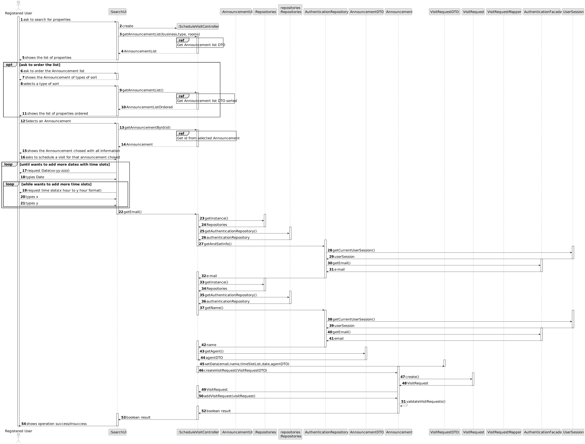

# US 009 -  I want to leave a message to the agent to schedule a visit
## 3. Design - User Story Realization

### 3.1. Rationale

**SSD - Alternative 1 is adopted.**

| Interaction ID | Question: Which class is responsible for...          | Answer                 | Justification (with patterns)                                                                                 |
|:---------------|:-----------------------------------------------------|:-----------------------|:--------------------------------------------------------------------------------------------------------------|
| Step 1  		     | 	...interacting with the User                        | SearchUI               | Pure Fabrication: there is no reason to assign this responsibility to any existing class in the Domain Model. |
|                | ...coordinating the US?	                             | AnnouncementController | Controller                                                                                                    |
| Step2 		       | ... knowing the user using the system?               | UserSession            | IE: cf. A&A component documentation.                                                                          |
|                | ... knowing email of the userLogged                  | AuthenticationRepository | IE: cf. A&A component documentation |
|                | ... knowing name of the userLogged                   | AuthenticationRepository | IE: cf. A&A component documentation |
| Step 3  		     | 	... displaying the UI for the actor to input data?  | SearchUI               | IE: is responsible for user interactions.                                                                     |
| 		             | 	... displaying the announcement list for the actor? | SearchUI               | IE: is responsible for user interactions.                                                                     |
| Step 4  		     | 	... receiving the input data?                       | SearchUI               | IE: is responsible for user interactions.                                                                     |
| Step 5	 		     | ... knowing the selected Announcement?               | AnnouncementRepository | IE: knows all its announcements                                                                               |
| Step 6		       | 	... knowing the selected Announcement to show?      | SearchUI               | IE: is responsible for user interactions.                                                                     |
| Step 7         | ... contain the information from UI to Domain | VisitRequestDTO | IE: is responsible to transfer the data between objects |
|                | ...instantiating a new Visit Request?		              | AnnouncementAvailable  | IE: knows/has its own visit requests                                                                          |
| Step 8		       | 	...saving inputed data                              | VisitRequest           | IE: object created in step 1 has its own data.                                                                |
| Step 9  		     | 	... saving the visit request?                       | AnnouncementAvailable  | IE: object created in step 1 is attributed to an Announcement                                                 |
|                | ...validating all data (global validation)?          | AnnouncementAvailable  | Information Expert: knows all its visit requests.                                                             | 
| Step 10  		    | ...informing operation                               | AnnouncementUI         | Information Expert: is responsible for user interactions.                                                     |

### Systematization ##
According to the taken rationale, the conceptual classes promoted to software classes are:

* Announcement
* Agent
* VisitRequest

Other software classes (i.e. Pure Fabrication) identified:
* SearchUI
* ScheduleVisitController

## 3.2. Sequence Diagram (SD)

###  Full Diagram

This diagram shows the full sequence of interactions between the classes involved in the realization of this user story.

## 3.3. Class Diagram (CD)

