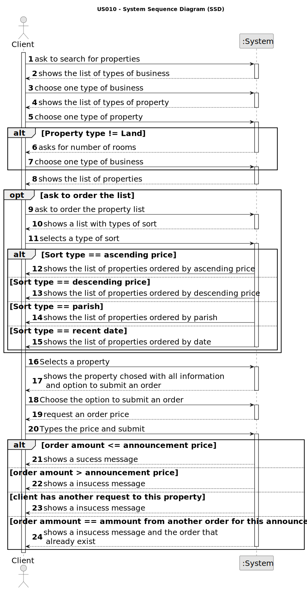

# US 010 - Place an order to purchase the property

## 1. Requirements Engineering

### 1.1. User Story Description

As a client, I place an order to purchase the property, submitting the order
amount

### 1.2. Customer Specifications and Clarifications 

**From the client clarifications:**

> **Question:** Let's suppose the client doesn't want to filter the properties. That means there will be shown both "sale" and "rent" announcements to him. If he later wants to sort them by price (ascending or descending), how does the comparison between a property for sale with a 200 000$ price (e.g.) and a property for rent with a 800$ monthly price (e.g.) and a 12 months contract duration (e.g.) should be?
>> **Answer:** If the actor does not chooses to filter properties by type of business (sale or rent), the property sale price and the property rent monthly price should used for sorting the properties.

> **Question:** When showing the other order on the screen, what data should be shown (eg client name, published date, order status)?
>> **Answer:** If the order amount submitted by the client has already been posted for the property (by another request from this client or any other client), the system must state that on the screen. The system should show the message "The order amount submitted has already been posted for this property. Please contact the agent that is responsible for this property.".

> **Question:** To order a purchase of a property, should the client be able to filter the properties by type of property, city, district....so that it's easier to find the wanted property, or should the system show the entire list of properties to sale?
>> **Answer:** The system should show a list of properties to the client. Filtering is a useful feature of the system, please prepare a user friendly and effective filtering to show the properties to the client.

> **Question:** Should this User Story be implemented as an addition to US001 (Users can display properties, and select one to make an order), or should it be completely separate, with a separate section of the app dedicated to it?
>> **Answer:** To place an order the actor should be registered in the system.

> **Question:** In US10, can the client remove an offer they made at any point, in order to replace it with a different one?
>> **Answer:** No.

> **Question:** When the client intends to place a purchase order, should the list of properties (announcements) be presented initially and then asked to select a property?
>> **Answer:** The system should show a list of properties to the client.

> **Question:** What data is required, in addition to the order value, so that a client can place an order to purchase a property?
>> **Answer:** Only the order amount.

### 1.3. Acceptance Criteria

* **AC1:** The order amount submitted by the client must be equal to or lower than
  the price set by the owner for the property.
* **AC2:**  If the order amount submitted by the client has already been posted for
  the property (by another request from this client or any other client), the
  system must state that on the screen and the order placed previously should be
  considered first when selling the property.
* **AC3:** A client can only submit a new order to purchase the same property after
  the previous one is declined.

### 1.4. Found out Dependencies

* None dependency

### 1.5 Input and Output Data

**Input Data:**

* Typed data:
	* Order price

* Selected data:
    * Property to submit an order to purchase

**Output Data:**

* Success/insuccess message

### 1.6. System Sequence Diagram (SSD)

