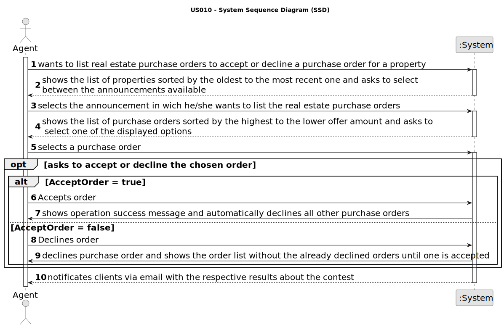

# US 011 - List real estate purchase orders to accept or decline a purchase order for a property
## 1. Requirements Engineering

### 1.1. User Story Description

 As an agent, I want to list real estate purchase orders to accept or decline a
purchase order for a property. After accepting or declining, an email notification
should be sent to the customer.

### 1.2. Customer Specifications and Clarifications

**From the specifications document:**
> All registered information, except the agency commission, can be accessed by the client who intends to buy or rent the property; the client is, then, responsible for being able to consult the properties by type, number of rooms, and sort by criteria such as price or the parish where the property is located.

**From the client clarifications:**

> **Question:** When the agent declines an order, she has to be removed from the list and system?
>> **Answer:** The order should be removed from the list but not from the system.

> **Question:** When the agent wants to list real estate purchase orders, does he/she list all of them at once or can a property be chosen to list the purchase orders that are related to that specific property?
>
>> **Answer:**  The properties should be sorted from the oldest to the most recent one. For each property, the list of purchase orders should be sorted by the amount offered, the highest offer must appear first.

> **Question:** Is it convenient to give the ability to filter the properties by their attributes when the agent is listing them?
>
>> **Answer:**  No. We always have a low number of purchase orders.

> **Question:** The notification should be sent to the client, but we need to consider this client the owner or the potential buyer?
>
>> **Answer:** The client is the registered user that placed the order (in US10).

> **Question:** Assuming the previous answer is the potential buyer, should the owner be informed about the sale success?
>
>> **Answer:** The owner will be contacted by means of a phone call. This is not a feature of the system.

> **Question:**  Does grouping purchase orders by property mean that only properties are displayed, and only after a property is selected are its requests shown? Or are all the requests shown but requests of the same property are shown together?
>>**Answer:** The system should show (to the agent) a list of properties that have purchase orders. For each property the system should show a list of purchase orders. Typically we have a small number of purchase orders and we want all orders shown (by property) without selecting a property in particular.

> **Question:** When properties are sorted form oldest to most recent, does this relate to when the property was added to the system or the property's date of construction?
>>**Answer:** This sorting should be made using the date when the property announcement was published by the agent.

### 1.3. Acceptance Criteria

* **▪ AC1. The list of purchase orders should be grouped by property. The properties
  should be sorted from the oldest to the most recent one. For each property, the
  list of purchase orders should be sorted by the amount offered, the highest offer
  must appear first.**
*  ▪ **AC2. For each offer, the agent must be able to accept or decline it. The action of
  accepting or declining an offer should trigger an email notification to the client.**
* **▪ AC3. When a purchase order is accepted, all the other orders should be declined,
  and a message sent to the client.**
*  ▪ **AC4. If a property does not contain any offers, the system should show an empty
  list of offers.**

### 1.4. Found out Dependencies

 Dependencies with the us1 when listed properties are displayed
 Dependencies with the us10 because in this us the agent accept/decline the orders placed in us10
### 1.5. Input and Output Data

**Input Data**
Selected data:
* Accept/decline order
* Choose announcement
* Choose order

**Output data**
* List of purchase orders
* List of announcements available

### 1.6. System Sequence Diagram (SSD)

### 1.7. Other Relevant Remarks
* **Brief format :**
  * An agent starts listing purchase orders. Selects the announcement he wants to evaluate (the announcements are sorted by the oldest to the mos recent one). Then the agent selects one of the orders he wants to decline/accept. If he accepts the order all the other orders corresponding to the announcement will be automatically declined. If he declines the order then he is redirected to the order menu to evaluate other orders until he accepts one or decides to cancel the evaluation. The clients who made the purchase orders will be notified via email about the result olf the contest. 
  
