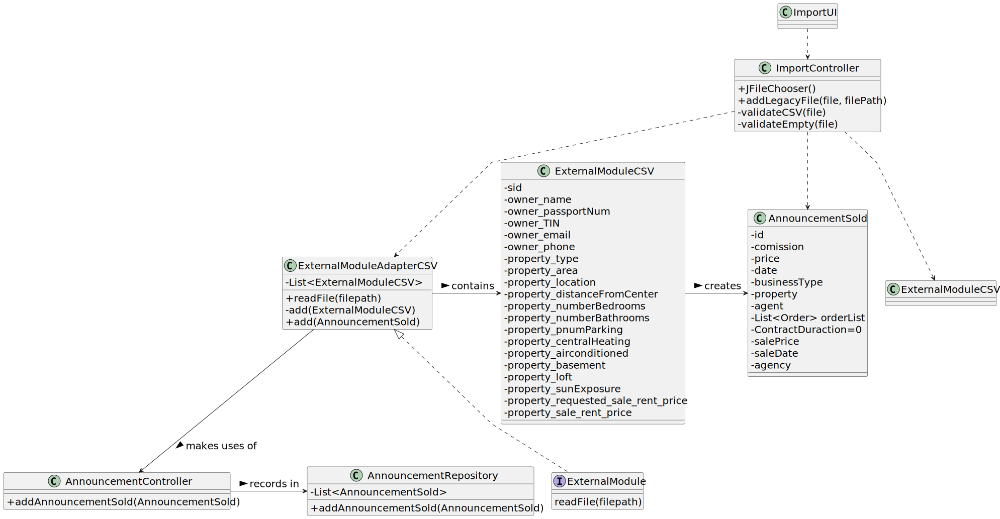

# US 012 -  import information from a legacy system

## 3. Design - User Story Realization 

### 3.1. Rationale

| Interaction ID | Question: Which class is responsible for...         | Answer                   | Justification (with patterns)                                                                                 |
|:---------------|:----------------------------------------------------|:-------------------------|:--------------------------------------------------------------------------------------------------------------|
| Step 1  		     | 	... interacting with the actor?                    | ImportFileUI             | Pure Fabrication: there is no reason to assign this responsibility to any existing class in the Domain Model. |
| 		             | 	... coordinating the US?                           | ImportController         | Controller                                                                                                    |
| Step 2  		     |                                                     |                          |                                                                                                               |
| Step 3 		      | 	... displaying the UI for the actor to input data? | ImportFileUI             | IE: is responsible for user interactions.                                                                     |
| Step 4  		     | 	... receiving the input data?                      | ImportFileUI             | IE: is responsible for user interactions.                                                                     |
| 		             | 	... reading file that was selected?                | ExternalModuleAdapterCSV | IE: is responsible for reading the file                                                                       |
| 		             | 	... create the announcement?                       | ExternalModuleAdapterCSV | IE: is responsible for creating the objects                                                                   |
| 		             | 	... save the announcement?                         | AnnouncementRepository   | IE: is responsible for save the Announcements.                                                                |
| Step 5  	      | 	... informing operation insuccess?                 | SearchUI                 | IE: is responsible for user interactions.                                                                     |
| Step 6  		     | 	... informing operation insuccess?                 | SearchUI                 | IE: is responsible for user interactions.                                                                     |

### Systematization ##

According to the taken rationale, the conceptual classes promoted to software classes are: 

 * ExternalModuleAdapterCSV
 * ExternalModule
 * AnnouncementRepository
 * AnnouncementSold

Other software classes (i.e. Pure Fabrication) identified: 

 * ImportUI  
 * ImportController
 * AnnouncementController

## 3.2. Sequence Diagram (SD)

### Alternative 1 - Full Diagram

This diagram shows the full sequence of interactions between the classes involved in the realization of this user story.

## 3.3. Class Diagram (CD)

