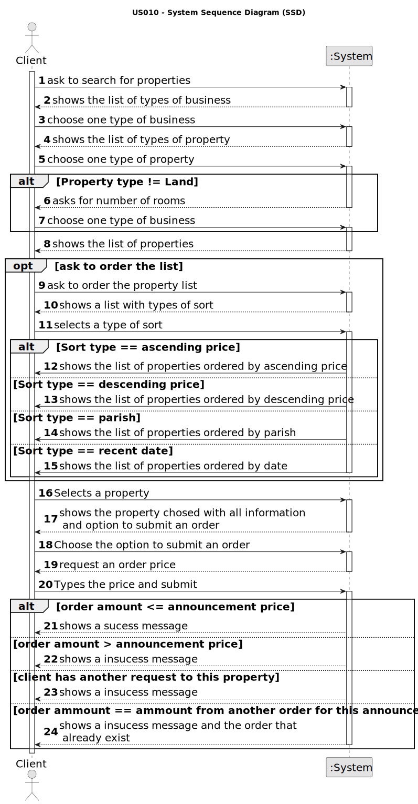

# US 014 - Read the response for the appointment requests

## 1. Requirements Engineering

### 1.1. User Story Description

As a client, I want to read the response for the appointment requests, to
accept or reject it.

### 1.2. Acceptance Criteria

* **AC1:** Appointment request responses should be sorted from the oldest to the
  newest.
* **AC2:** When an appointment request is accepted for a property, all other requests
  for the same property should be automatically rejected.
* **AC3:** When rejecting an appointment request, the client should be able to suggest
  a new date and time for the visit, thus triggering a new appointment request.

### 1.3. Found out Dependencies
* US09 - As a client, I want to leave a message to the agent to schedule a visit to a
  property of my interest

### 1.4. Input and Output Data

**Input Data:**

* Typed data:
	* Time slot (x hour to y hour format)
    * Date

* Selected data:
    * time slot to accept/reject/counterPurpose

**Output Data:**

* Success/insuccess message

### 1.5. System Sequence Diagram (SSD)

