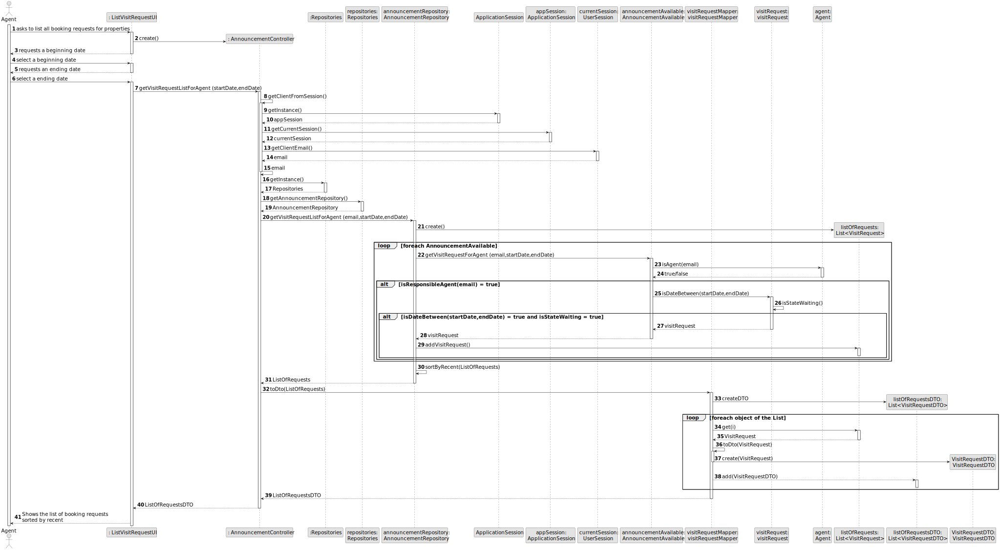
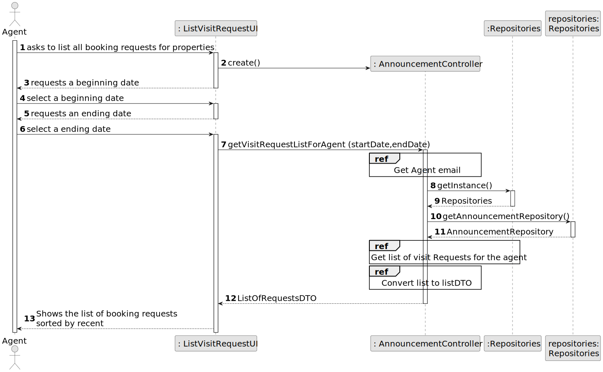
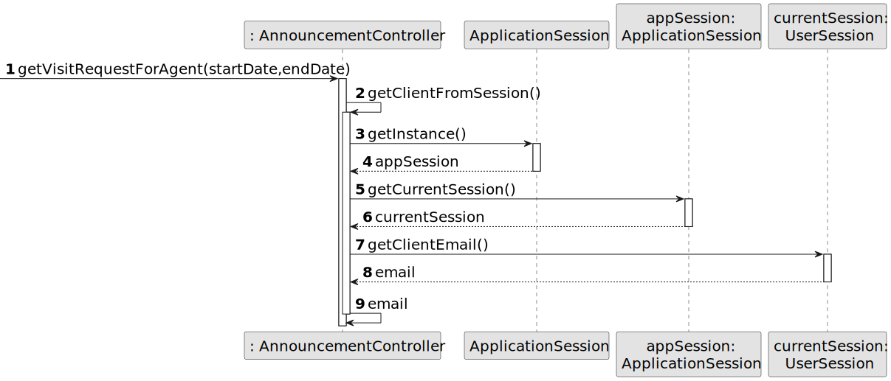
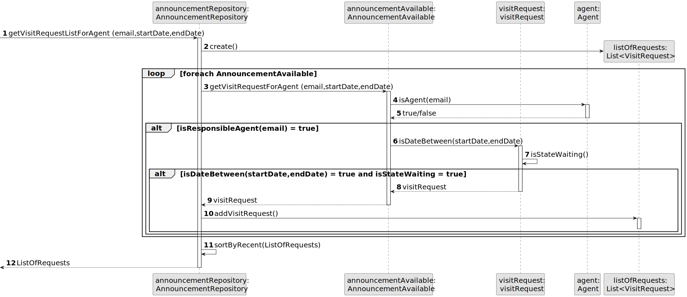
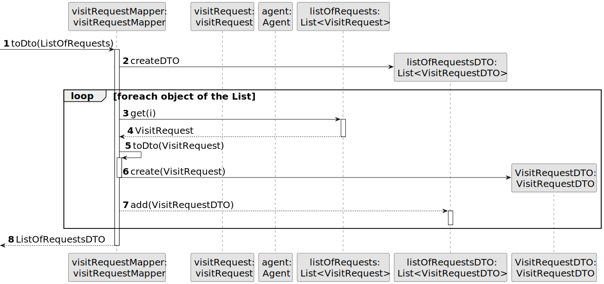
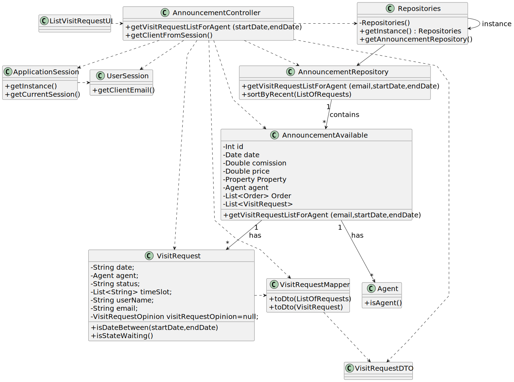

# US 015 - List all booking requests for properties managed by me.

## 3. Design - User Story Realization 

### 3.1. Rationale

| Interaction ID | Question: Which class is responsible for...                                            | Answer                 | Justification (with patterns)                                                                                 |
|:---------------|:---------------------------------------------------------------------------------------|:-----------------------|:--------------------------------------------------------------------------------------------------------------|
| Step 1  		     | 	... interacting with the actor?                                                       | ListVisitRequestUI     | Pure Fabrication: there is no reason to assign this responsibility to any existing class in the Domain Model. |
| 		             | 	... coordinating the US?                                                              | AnnouncementController | Controller                                                                                                    |
| Step 2  		     | 	... showing the list to the actor?	                                                   | ListVisitRequestUI     | IE: is responsible for user interactions.                                                                     |
| Step 3  		     | 	                                                                                      | ListVisitRequestUI     | IE: is responsible for user interactions.                                                                     |
| Step 4  		     | 	... displaying the UI for the actor to input data?                                    |                        |                                                                                                               |
| Step 5  	      | ... displaying the UI for the actor to input data?                                     | ListVisitRequestUI     | IE: is responsible for user interactions.                                                                     |
| 		             | 	...getting all the Announcements?                                                     | AnnouncementRepository | IE: knows all Announcements.                                                                                  |
| 		             | 	...check if is the agent of Announcement?                                             | AnnouncementAvailable  | IE: owns its agent.                                                                                           |
| 		             | ...check if the Visit Request of the Announcement corresponde to the date and state? 	 | VisitRequest           | IE: owns its date and state.                                                                                  |
| 		             | ...convert the Visit Request List to DTO?	                                             | VisitRequestMapper     | IE: is responsible for converting the VisitRequest object to VisitRequestDTO.                                 |
| Step 6  		     | ...showing the list to actor?                                                          | ListVisitRequestUI     | IE: is responsible for user interactions.                                                                     |

### Systematization ##

According to the taken rationale, the conceptual classes promoted to software classes are: 

 * AnnouncementRepository
 * AnnouncementAvailable
 * VisitRequest
 * VisitRequestMapper

Other software classes (i.e. Pure Fabrication) identified: 

 * ListVisitRequestUI
 * AnnouncementController

## 3.2. Sequence Diagram (SD)

### Alternative 1 - Full Diagram

This diagram shows the full sequence of interactions between the classes involved in the realization of this user story.

### Alternative 2 - Split Diagram

This diagram shows the same sequence of interactions between the classes involved in the realization of this user story, but it is split in partial diagrams to better illustrate the interactions between the classes.

**Get Agent Email**

**Get List of Visit Requests for the agent**

**Convert List of Visit Requests in DTO**

## 3.3. Class Diagram (CD)

