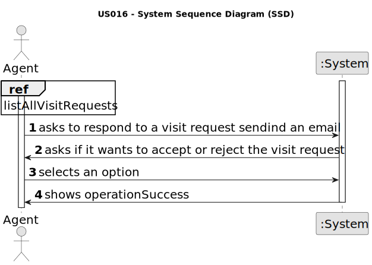

# US 016 - Respond to the user that scheduled the visit

## 1. Requirements Engineering

### 1.1. User Story Description

As an agent, when viewing a booking request, I want to respond to the user
that scheduled the visit.

### 1.2. Customer Specifications and Clarifications

**From the client clarifications:**

> **Question:**
>> **Answer:**

### 1.3. Acceptance Criteria

* **AC1:** AC1. The response is sent by email.
* **AC2:** Different email services can send the message. These services must be
  configured using a configuration file to enable using different platforms (e.g.:
  gmail, DEI's email service, etc.)
* **AC3:** The response should include the name and phone number of the
  responsible Agent.
* **AC4:** The response should include the property identification and location.
* **AC5:** When an Agent responds to a booking request the list of booking requests
  should be updated to not show this request

### 1.4. Found out Dependencies

* Us15

### 1.5 Input and Output Data

**Input Data:**

* Selected data:
    * VisitRequest

**Output Data:**

* Email

### 1.6. System Sequence Diagram (SSD)

