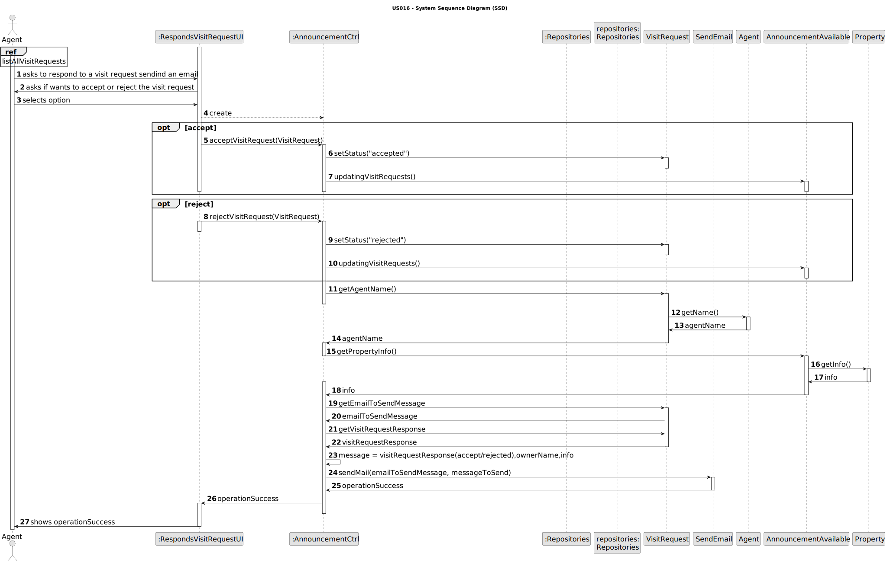
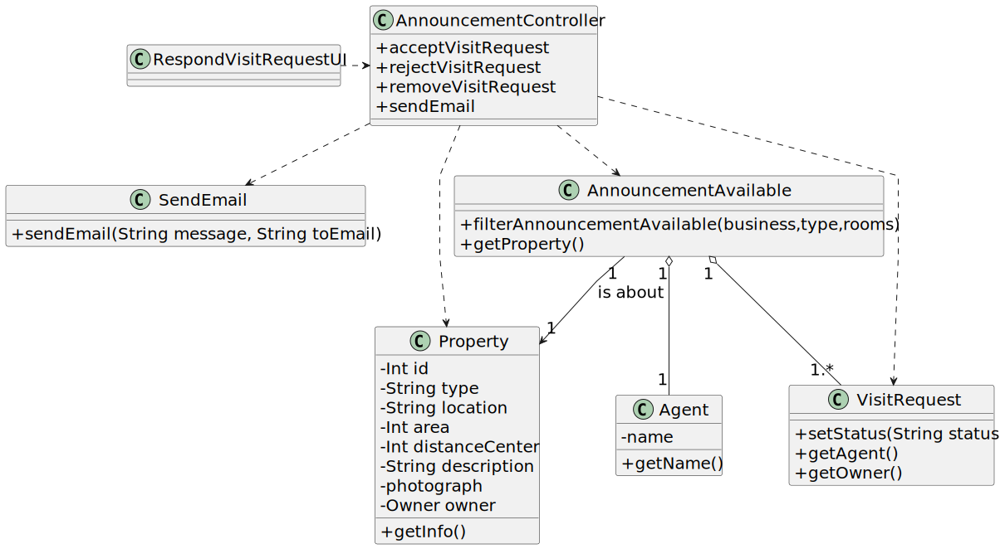

# US 016 - Respond to the user that scheduled the visit

## 3. Design - User Story Realization 

### 3.1. Rationale

| Interaction ID | Question: Which class is responsible for...                                         | Answer                 | Justification (with patterns)                                                                                 |
|:---------------|:------------------------------------------------------------------------------------|:-----------------------|:--------------------------------------------------------------------------------------------------------------|
| Step 1  		     | 	... interacting with the actor?                                                    | RespondsVisitRequestUI | Pure Fabrication: there is no reason to assign this responsibility to any existing class in the Domain Model. |
| 		             | 	... coordinating the US?                                                           | AnnouncementCtrl       | Controller                                                                                                    |
| Step 2  		     | 	... changing the status of the visit request accordingly the responde of the user	 | VisitRequest           | IE: knows/owns its status                                                                                     |
| Step 3         | ... updating visitRequests                                                          | AnnouncementAvailable  | IE: owns all its visit requests                                                                               |
| Step 4         | ... get agent                                                                       | VisitRequest           | IE: each visitRequest has an agent                                                                            |
| Step 5         | ... get agent name                                                                  | Agent                  | IE: know/owns its name                                                                                        |
| Step 6         | ... get property                                                                    | Announcement           | IE: each announcement has a property associated                                                               |
| Step 7         | ... get property info                                                               | Property               | IE: know/owns its info                                                                                        |
| Step 8         | ... get owner of visit request email                                                | VisitRequest           | IE: know/owns the info of the one who made the visit request                                                  | 
| Step 9         | ... send an email                                                                   | SendEmail              | IE : Its responsible for sending emails                                                                       |
| Step 10  		    | 	... informing operation insuccess?                                                 | RespondsVisitRequestUI | IE: is responsible for user interactions.                                                                     |

### Systematization ##

According to the taken rationale, the conceptual classes promoted to software classes are: 

 * VisitRequest
 * AnnouncementAvailable
 * Agent
 * Property
 * SendEmail
 

Other software classes (i.e. Pure Fabrication) identified: 

 * RespondsVisitRequestUI
 * AnnouncementCtrl      

## 3.2. Sequence Diagram (SD)

### Alternative 1 - Full Diagram

This diagram shows the full sequence of interactions between the classes involved in the realization of this user story.

## 3.3. Class Diagram (CD)

