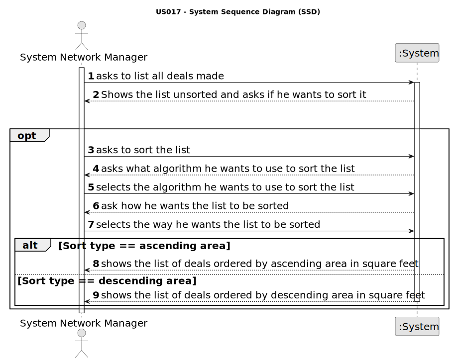

# US 017 - List all deals made

## 1. Requirements Engineering

### 1.1. User Story Description

As a network manager, I want to list all deals made.

### 1.2. Customer Specifications and Clarifications 

**From the client clarifications:**

> **Question:** Regarding the Algorithms, is it supposed to be one for each sorting order, or must both algorithms present both sorting orders?
>> **Answer:** The two algorithms can be used for both sorting orders.

> **Question:** We have to present information about the deal, but is it necessary to display any information about the agent/agency that oversees the deal?
>> **Answer:** Yes, show the store ID and the store name.

> **Question:** What should be the default order of the deals when displaying them to the network manager?
>> **Answer:** The default is to sort deals from the most recent ones to the oldest ones.

### 1.3. Acceptance Criteria

* **AC1:** The actor should be able to sort all properties by property area (square feet)
  in descending/ascending order.
* **AC2:** Two sorting algorithms should be implemented (to be chosen manually by
  the network manager).
* **AC3:** Worst-case time complexity of each algorithm should be documented in the
  application user manual that must be delivered with the application (in the
  annexes, where algorithms should be written in pseudocode).

### 1.4. Found out Dependencies

* None dependency

### 1.5 Input and Output Data

**Input Data:**

* Selected data:
    * Type of sort of the list

**Output Data:**

* Success/insuccess message

### 1.6. System Sequence Diagram (SSD)

