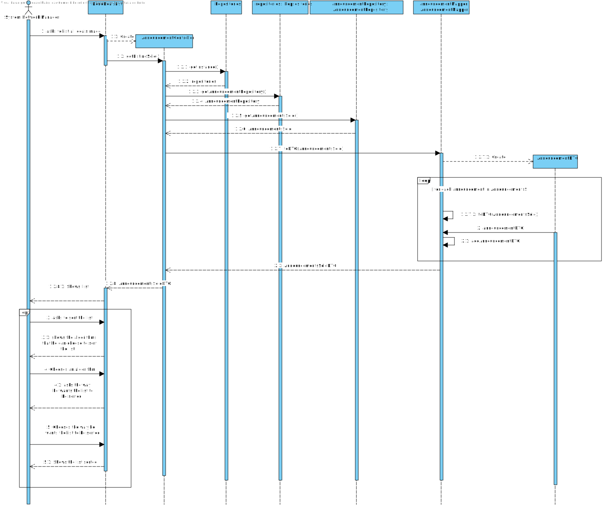
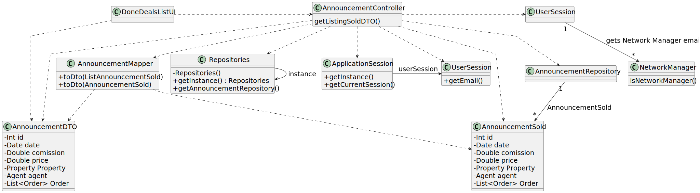

# US 017 - List all deals made

## 3. Design - User Story Realization 

### 3.1. Rationale

| Interaction ID   | Question: Which class is responsible for...                              | Answer                 | Justification (with patterns)                                                                                 |
|:-----------------|:-------------------------------------------------------------------------|:-----------------------|:--------------------------------------------------------------------------------------------------------------|
| Step 1  		       | 	... listing all deals?                                                  | ListAllDealsUI         | Pure Fabrication: there is no reason to assign this responsibility to any existing class in the Domain Model. |
| 		               | 	... coordinating the listing process?                                   | AnnouncementController | Controller                                                                                                    |
 |                  | ... accessing the repositories?                                          | Repositories           |                                                                 IE: knows/has all the repositories                |
|                  | ... accessing the purchase orders repository?                            | AnnouncementRepository |                                                                IE: has all the purchase orders                |
| Step 2  		       | 		 ... showing the list to the actor?                                    | ListDealsUI            |       IE: is responsible for user interactions.                                                                                                       |
| 		               | ...convert the Announcement Sold List to DTO?	                           | AnnouncementMapper     | IE: is responsible for converting the VisitRequest object to VisitRequestDTO.                                 |
| Step 3           | ...asking the actor to sort the list?                                    | ListDealsUI            |IE: is responsible for user interactions. |
| 		               | 		 ... creating the sorting service?                                     | Comparators            |       Pure Fabrication: there is no reason to assign this responsibility to any existing class in the Domain Model.                                                                                                        |
| 		               | 	.. listing the deals newest to oldest?                                  | AnnouncementRepository | Repository                                                                     |
| 		               | 	     .. presenting the default sorted deals to the StoreNetworkManager? | ListDealsUI            |     Pure Fabrication: there is no reason to assign this responsibility to any existing class in the Domain Model.                                                                                                          |
| 	                | ... continuing the sorting process?                                      | StoreNetworkManager    | The StoreNetworkManager is responsible for deciding whether to continue the sorting process or not.                                                                     |
| 		Step 4 (opt)   | 	   ... choosing the sorting algorithm?                                  | StoreNetworkManager    |   The StoreNetworkManager selects the sorting algorithm to be used.                                                                                                            |
| 		   Step 5(opt) | ... selecting the type of ordering (ascending/descending)?               | StoreNetworkManager    | The StoreNetworkManager chooses the type of ordering (ascending or descending) for the selected sorting algorithm.                                                                     |
| 		               | 	... performing ascending bubble sort on the list of deals?              | Comparators            | Pure Fabrication: there is no reason to assign this responsibility to any existing class in the Domain Model.                                                                |
| 	 		             | 	.. performing descending bubble sort on the list of deals?              | Comparators            | Pure Fabrication: there is no reason to assign this responsibility to any existing class in the Domain Model.                                                           |
| 		               | ... performing ascending second algorithm on the list of deals?          | Comparators            | Pure Fabrication: there is no reason to assign this responsibility to any existing class in the Domain Model..                                                                     |
| 		               | 	  ... performing descending second algorithm on the list of deals?      | Comparators            |        Pure Fabrication: there is no reason to assign this responsibility to any existing class in the Domain Model.                                                                                                       |
| 	Step 6/3	       | 	... presenting the sorted list to the StoreNetworkManager?              | ListDealsUI            | IE: is responsible for user interactions.                                                                    |
### Systematization ##

According to the taken rationale, the conceptual classes promoted to software classes are: 

 * Announcement
 * UserSession
 * Order
 * Property
 * AnnouncementMapper
 * OrderMapper
 * announcementDTO
 * AnnouncementRepository

Other software classes (i.e. Pure Fabrication) identified: 

 * SearchUI  
 * AnnouncementController

## 3.2. Sequence Diagram (SD)

### Alternative 1 - Full Diagram

This diagram shows the full sequence of interactions between the classes involved in the realization of this user story.

## 3.3. Class Diagram (CD)

