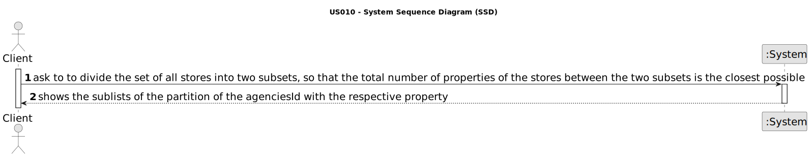

# US 019 -  Divide the set of all stores into two subsets

## 1. Requirements Engineering

### 1.1. User Story Description

As a client, I place an order to purchase the property, submitting the order
amount

### 1.2. Customer Specifications and Clarifications

**From the client clarifications:**

> **Question:** Let's suppose the client doesn't want to filter the properties. That means there will be shown both "
> sale" and "rent" announcements to him. If he later wants to sort them by price (ascending or descending), how does the
> comparison between a property for sale with a 200 000$ price (e.g.) and a property for rent with a 800$ monthly price (
> e.g.) and a 12 months contract duration (e.g.) should be?
>> **Answer:** If the actor does not chooses to filter properties by type of business (sale or rent), the property sale
> > price and the property rent monthly price should used for sorting the properties.

### 1.3. Acceptance Criteria

* **AC1:** AC1. The application should implement a brute-force algorithm, an algorithm
  which consists of calculating all the partitions of cardinal 2 and finding out which
  one is the minimum for the difference of the sum of the elements of each sublist.
* **AC2:**  The algorithm should return the sublists of the partition (each sublist should
  contain a set of tuples with two elements each, the storeID and the number of
  properties manage by the store) that satisfies the stated condition and also the
  difference between the sums of the elements of the sublists. In the user manual,
  this algorithm must be written in pseudocode.
* **AC3:** Runtime tests for variable length n input lists, with com n = 3, 6, 9, ..., 30
  (asymptotic behavior) should be performed. In each run the number of stores
  should be chosen sequentially. In the user manual, the results of measuring the
  time of each algorithm for one/several inputs of the same size, as also the graphic
  of the asymptotic behavior of the execution time should be presented (use a unit
  of time that allows you to distinguish the running times of all tested examples).
  Also, it should be presented the input list, the two sublists that make up the
  partition and difference of sums, for at least one example of each input size.
* **AC4**  Worst-case time complexity of the algorithm should be documented in the
  application user manual (in the annexes, where algorithms should be written in
  pseudocode) that must be delivered with the application

### 1.4. Found out Dependencies

* None dependency

### 1.5 Input and Output Data

**Input Data:**

* None

**Output Data:**

* the sublists of the partition of the agencies with the respective property

### 1.6. System Sequence Diagram (SSD)

