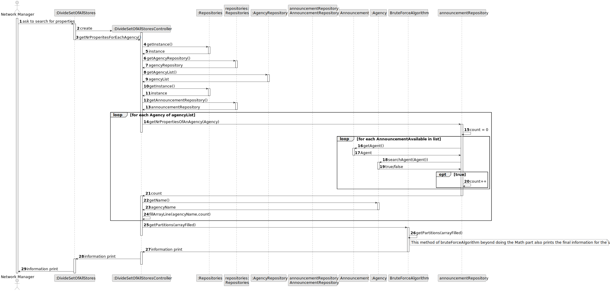
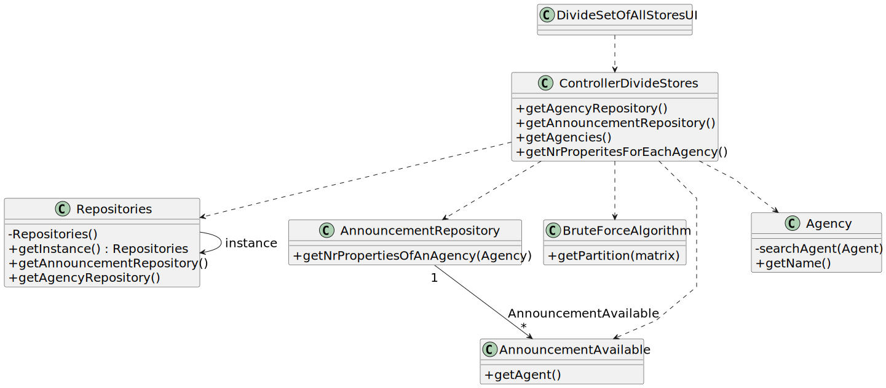

# US 019 -  Divide the set of all stores into two subsets

## 3. Design - User Story Realization 

### 3.1. Rationale

| Interaction ID | Question: Which class is responsible for...                                    | Answer                  | Justification (with patterns)                                                                                              |
|:---------------|:-------------------------------------------------------------------------------|:------------------------|:---------------------------------------------------------------------------------------------------------------------------|
| Step 1  		     | 	... interacting with the actor?                                               | DivideSetOfAllStoresUI  | Pure Fabrication: there is no reason to assign this responsibility to any existing class in the Domain Model.              |
| 		             | 	... coordinating the US?                                                      | ControllerDivideSttores | Controller                                                                                                                 |
| Step 2         | ... obtaining the agency list?                                                 | AgencyRepository        | Information Expert : know all its Agencies                                                                                 |
| Step 3  		     | 	... obtaining the announcements list?                                         | AnnouncementRepository  | Information Expert: know all its Announcements                                                                             |
| Step 4         | ... getNumberOfProperties?                                                     | AnnouncementRepository  | Information Expert : all properties are attributed to announcements and all all announcements are known by this repository |
| Step 5         | ... getAgent  ?                                                                | Announcement            | IE: every announcement has an agent                                                                                        |
 | Step 6         | ... searchAgent?                                                               | Agency                  | IE: knows all its agents                                                                                                   |
| Step 7         | ... get partitions with mininum diference ?                                    | BruteForceAlgorithm     | IE: owns the mathematics method                                                                                            |
| Step 8         | ... get the values(partitions,difference between partitions) to show the user? | BruteForceAlgorithm     | IE: knows the result values                                                                                                |
| Step 9  		     | 	... showing the information to user?                                          | DivideSetOfAllStoresUI  | IE: is responsible for user interactions.                                                                                  |

### Systematization ##

According to the taken rationale, the conceptual classes promoted to software classes are: 

 * Announcement
 * BruteForceAlgorithm
 * Agency
 * AnnouncementRepository
 * AgencyRepository

Other software classes (i.e. Pure Fabrication) identified: 

 * DivideSetOfAllStoresUI 
 * ControllerDivideSttores

## 3.2. Sequence Diagram (SD)

### Alternative 1 - Full Diagram

## 3.3. Class Diagram (CD)

