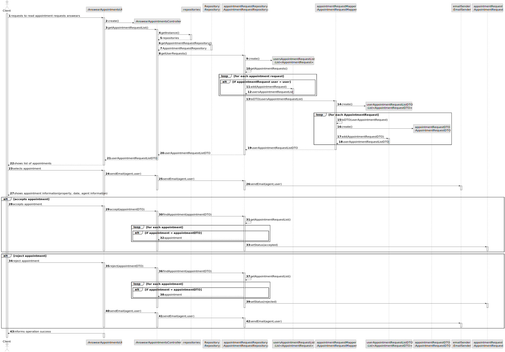
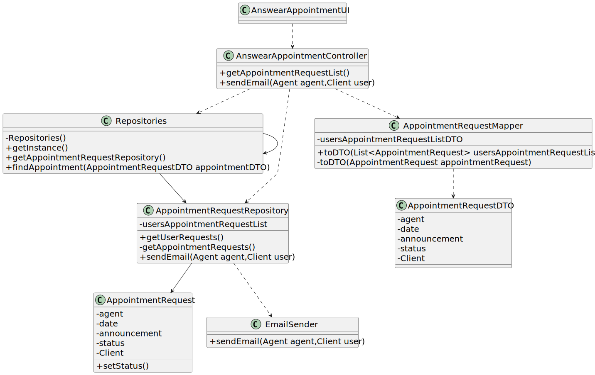

# US 020 - read responses for appointment requests and accept or reject them

## 3. Design - User Story Realization 

### 3.1. Rationale

**SSD - Alternative 1 is adopted.**

| Interaction ID | Question: Which class is responsible for... | Answer               | Justification (with patterns)                                                                                 |
|:-------------  |:--------------------- |:---------------------|:--------------------------------------------------------------------------------------------------------------|
| Step 1  		 |	... interacting with the actor? | AnswearAppointmentUI        | Pure Fabrication: there is no reason to assign this responsibility to any existing class in the Domain Model. |
| 			  		 |	... coordinating the US? | AnswearAppointmentController | Controller   |
|  		 |	...knowing all AppointmentRequests?|   AppointmentRequestRepository   | IE:AppointmentRequestRepository knows all AppointmentRequests|
|		 |... transfer data of the domain to the UI?| AppointmentRequestDTO                | DTO: separating UI and domain data.  |
| 	 |... mapping the transferred ?|AppointmentRequestMapper|Creator: sits between the domain and the DTO							 |                      |
| Step 2|	...Showing the Appointment Requests|    AppointmentRequestUI     |   Pure Fabrication: there is no reason to assign this responsibility to any existing class in the Domain Model.   |  
| Step 3|	...notify the agent that the user has received its email|    EmailSender    |   Pure Fabrication: there is no reason to assign this responsibility to any existing class in the Domain Model.   |     
| Step 4|	...Showing the Appointment Request information|    AppointmentRequestUI     |   Pure Fabrication: there is no reason to assign this responsibility to any existing class in the Domain Model.   | 
| Step 5|	...accepting the Appointment|    AppointmentRequest     |   information expert: knows its information therefore is responsible for its status |  
| Step 6|	...rejecting the Appointment|    AppointmentRequest     |   information expert: knows its information therefore is responsible for its status | 
| Step 7|	...displaying operation success message|    AppointmentRequestUI     |   Pure Fabrication: there is no reason to assign this responsibility to any existing class in the Domain Model.   |  
### Systematization ##

According to the taken rationale, the conceptual classes promoted to software classes are: 

 * AppointmentRequest

Other software classes (i.e. Pure Fabrication) identified: 

 * AnswearAppointmentRequestUI  
 * AnswearAppointmentRequestController
 * Repositories
 * AppointmentRequestRepositories
 * AppointmentRequestMapper
 * AppointmentRequestDTO
 * EmailSender

## 3.2. Sequence Diagram (SD)

### Alternative 1 - Full Diagram

This diagram shows the full sequence of interactions between the classes involved in the realization of this user story.

## 3.3. Class Diagram (CD)

