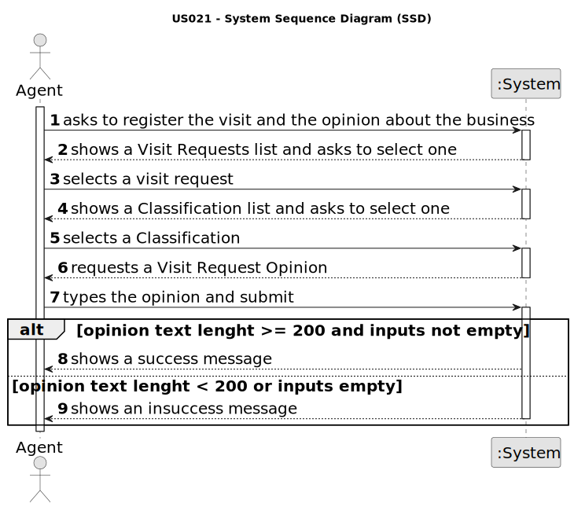

# US 021 - Register the visit and the opinion about the business

## 1. Requirements Engineering

### 1.1. User Story Description

As an agent, at the end of the visit, I want to register the visit and the
opinion about the business.

### 1.2. Customer Specifications and Clarifications

**From the client clarifications:**

> **Question:** in user story 21, they only ask to register the visit and give an opinion about it. I wanted to know if it's just that, or is it also necessary to schedule it and register after it has occurred? because User story 09 was not about scheduling, the customer just sent an email. and in 21, he registers the visit and opines. there is no user story that handles scheduling so I would like to know concretely what the customer wants.
>> **Answer:**  In US21 the agent only wants to register the visit and the opinion about the business.

### 1.3. Acceptance Criteria

* **AC1:** The opinion must be an alphanumeric type with 200 characters.
* **AC2:** A classification scale from 1 (most improbable) to 5 (most probable) stating
  the agent opinion whether the deal will go through.
* **AC3:** No duplicate entries for the same visit should be allowed.

### 1.4. Found out Dependencies

* **US 014 -** The client needs to add a visit Request to the agent register the opnion.

### 1.5 Input and Output Data

**Input Data:**

* Selected data
  * Visit Request
  * Classification

* Typed data
  * Opinion text

**Output Data:**

* A message of success

### 1.6. System Sequence Diagram (SSD)

