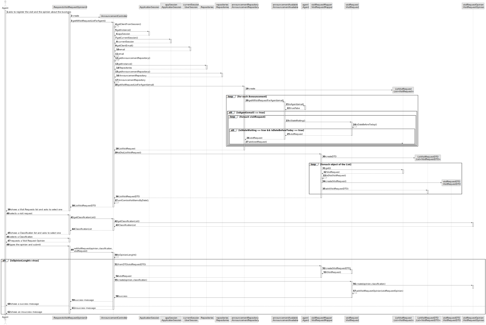
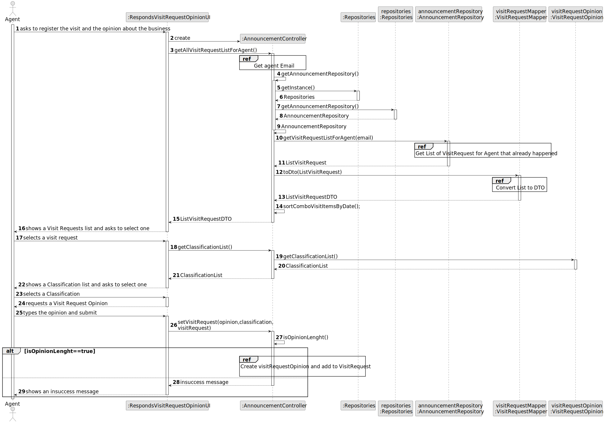
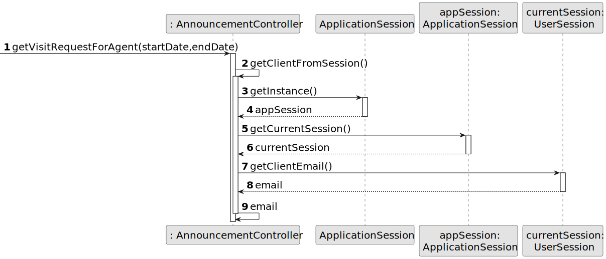
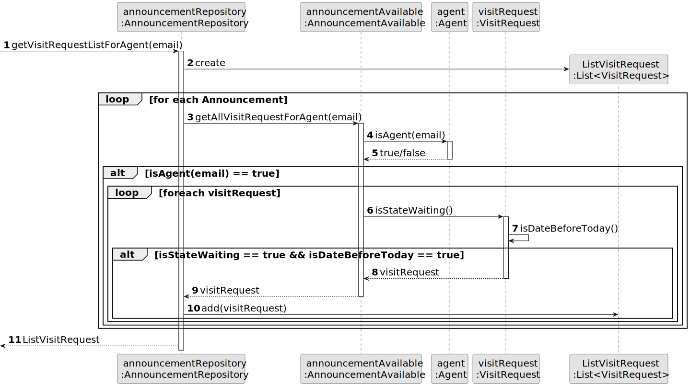
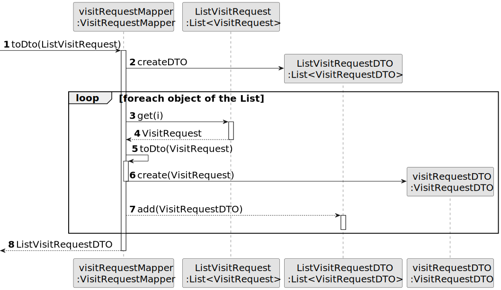
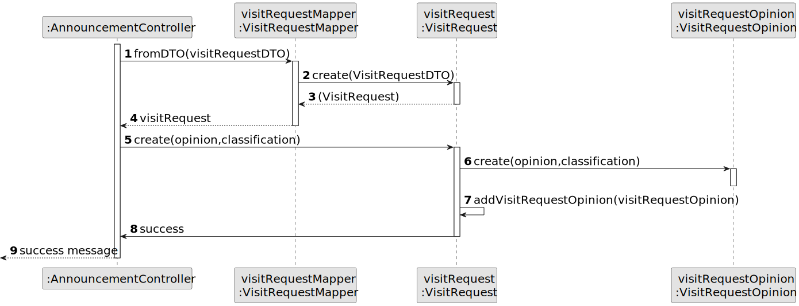
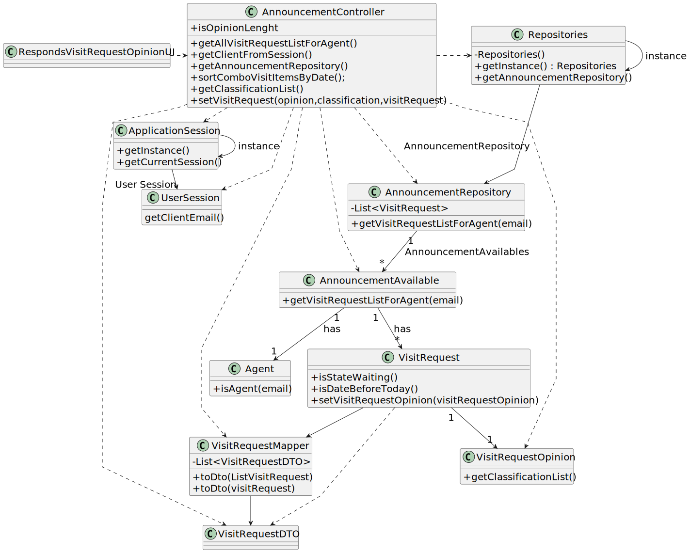

# US 021 - Register the visit and the opinion about the business

## 3. Design - User Story Realization 

### 3.1. Rationale

| Interaction ID | Question: Which class is responsible for...              | Answer                        | Justification (with patterns)                                                                                 |
|:---------------|:---------------------------------------------------------|:------------------------------|:--------------------------------------------------------------------------------------------------------------|
| Step 1  		     | 	... interacting with the actor?                         | RespondsVisitRequestOpinionUI | Pure Fabrication: there is no reason to assign this responsibility to any existing class in the Domain Model. |
| 		             | 	... coordinating the US?                                | AnnouncementController        | Controller                                                                                                    |
| 		             | 	... knowing the actor using the system?                 | UserSession                   | IE: cf. A&A component documentation.                                                                          |
| 		             | 	... getting all Announcement for the agent?             | AnnoncementRepository         | IE: owns the announcement list                                                                                |
| 		             | 	... creating a List of VisitRequest?                    | AnnoncementRepository         | Creator :  it is the one that contains all announcemetnts, that contains the visit requests                   |
| 		             | 	... validating agent from Announcement?                 | AnnouncementAvailable         | IE: owns its data                                                                                             |
| 		             | 	... validating the date and state of the visit Request? | VisitRequest                  | IE: owns its data                                                                                             |
| 		             | 	... converting the list to DTO?                         | VisitRequestMapper            | IE: is the responsible for converting Objects to DTOs                                                         |
| Step 2  		     | 	... displaying the list to the actor?	                  | RespondsVisitRequestOpinionUI | IE: is responsible for user interactions.                                                                     |
| Step 3  		     | 	... getting the list of classifications?                | VisitRequestOpinion           | IE : owns its classification list                                                                             |
| Step 4  		     | ... showing the list of classification to the actor?	    | RespondsVisitRequestOpinionUI | IE: is responsible for user interactions.                                                                     |
| Step 5  	      |                                                          |                               |                                                                                                               |
| Step 6  		     | ... displaying the UI for the actor to input data?       | RespondsVisitRequestOpinionUI | IE: is responsible for user interactions.                                                                     |
| Step 7         | ... convert VisitRequestDTO Chosed to object?            | VisitRequestMapper            | IE: is the responsible for converting DTOs to Objects                                                         |
| 		             | 	... instantiating a new VisitRequestOpinion?            | VisitRequest                  | Creator: in the DM VisitRequest has a VisitRequestOpinion.                                                    |
|                | ... saving the created visitRequestOpinion?              | VisitRequest                  | IE: owns its data.                                                                                            |
| Step 8         | ... displaying a insuccess message?                      | RespondsVisitRequestOpinionUI | IE: is responsible for user interactions.                                                                     |
| Step 9  		     | 	... displaying a success message?                       | RespondsVisitRequestOpinionUI | IE: is responsible for user interactions.                                                                     |

### Systematization ##

According to the taken rationale, the conceptual classes promoted to software classes are: 

 * UserSession
 * AnnoncementRepository
 * AnnouncementAvailable
 * AnnouncementRepository
 * AgencyRepository

Other software classes (i.e. Pure Fabrication) identified: 

 * RespondsVisitRequestOpinionUI 
 * AnnouncementController

## 3.2. Sequence Diagram (SD)

### Alternative 1 - Full Diagram

This diagram shows the full sequence of interactions between the classes involved in the realization of this user story.

### Alternative 2 - Split Diagram

This diagram shows the same sequence of interactions between the classes involved in the realization of this user story, but it is split in partial diagrams to better illustrate the interactions between the classes.

**Get Agent Email**

**Get List of Visit Requests for the agent**

**Convert List of Visit Requests in DTO**

**Create VisitRequestOpinion and add to VisitRequest**

## 3.3. Class Diagram (CD)

